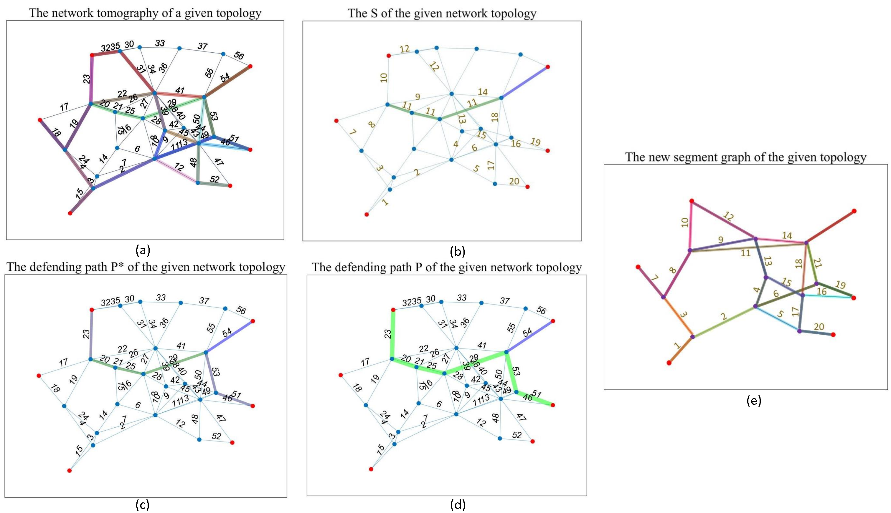
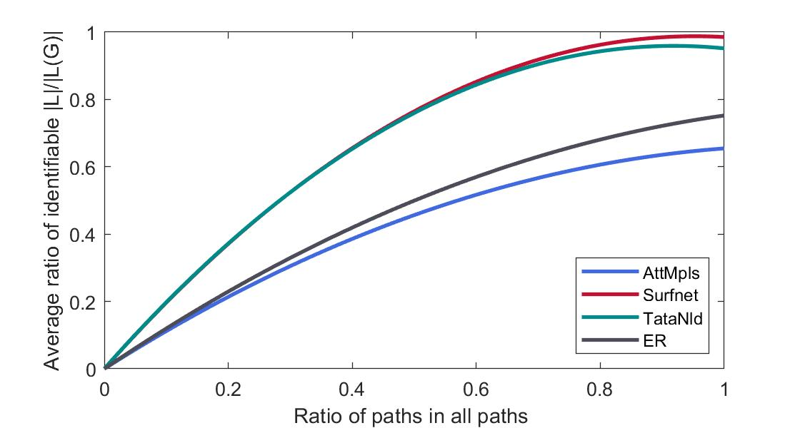

<h2 align = "center">
A fault diagnosis method to defend scapegoating attack in network tomography
</h2>
<h4 align = "center" >
Proceedings of <a href="https://www.sciencedirect.com/science/article/pii/S0304397522006399"> TCS 2023 </a>
</h4>

Xiaojia Xu^1^, Yongcai Wang^1,*^,  Yu Zhang^1^, Deying Li^1^

^1^ School of Information, Renmin University of China, Beijing, 100872 

<center>
  <a href="defend.pdf"> 
  </a>
</center>

<h2 align = "center">
Overview 
</h2>
The scapegoating attack can cause persistent and inconspicuous performance degradation in network tomography. Defense of scapegoating attack is therefore a critical problem. Theoretically, the ideal defending scheme is to add monitoring paths to make all the links in the network be identifiable. This requires very high monitoring cost, which is unaffordable. To overcome this problem, this paper proposes a diagnosis-based defending scheme for scapegoating attack, which diagnoses scapegoating attack when problematic links are detected by network tomography. The latent fact is that a scapegoating attack can be launched only when the link set manipulated by the attacker cuts the probing paths going through the scapegoat links and is not traversed by any monitoring path. This cut set is called unobserved cut set (UCS). To defense, we propose to find the UCS and add the minimum number of probing paths to traverse the UCS, so that the condition of scapegoating attack is broken and the attacking links can be detected if any scapegoating attack exists. A minimum set cover model is proposed to select the least number of defense links to cover the UCS, and a polynomial time algorithm is proposed to generate the least number of probing paths to go through the selected defense links. Evaluations on various network dataset show the effectiveness of the proposed attack and defense strategies.

<h2 align = "center">
Contribution
</h2>


-   **1)**: Firstly, the necessary and sufficient condition to launch scapegoating attack is proposed. It is that the attacker manipulates all links in a minimal cut set of the probing paths that pass through the scapegoat links but are not observed by any probing path. Such link sets are called unobserved cut set (UCS).
-   **2)**: This paper proposes to find the UCS and add the minimum number probing paths to traverse them, so that the condition of scapegoating attack is broken and the attacking links can be detected if any scapegoating attack exists.
-   **3)**: A minimum set cover model is proposed for selecting the least number of defense links to cover all the UCS; a greedy approximation algorithm with HK ratio is proposed to solve the defense link selection problem; and a polynomial time edge-disjoint path generation algorithm is proposed to generate defending paths to traverse these links-to-defend.
-   **4)**: Extensive verification on real network datasets shows the effectiveness of the proposed defense strategies.

<h2 align = "center">
Evaluations
<h2>






<h2 align = "center">
Bibtex
</h2>
```tex
@article{XU2023237,
title = {A fault diagnosis method to defend scapegoating attack in network tomography},
journal = {Theoretical Computer Science},
volume = {939},
pages = {237-249},
year = {2023},
issn = {0304-3975},
doi = {https://doi.org/10.1016/j.tcs.2022.10.029},
url = {https://www.sciencedirect.com/science/article/pii/S0304397522006399},
author = {Xiaojia Xu and Yongcai Wang and Yu Zhang and Deying Li},
keywords = {Network tomography, Fault diagnosis, Unobserved cut set, Scapegoating attack, Identifiability}
}

```


<h2 align = "center">
Acknowledgment 
</h2>
This work is partially supported by the National Natural Science Foundation of China Grant No. 12071478, 61972404. Public Computing Cloud, Renmin University of China.


