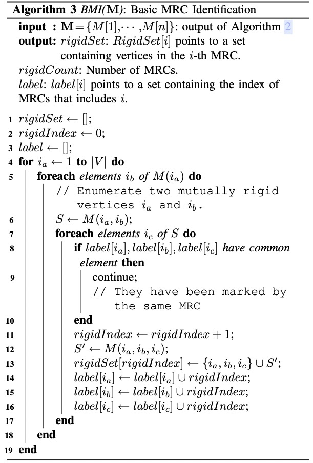
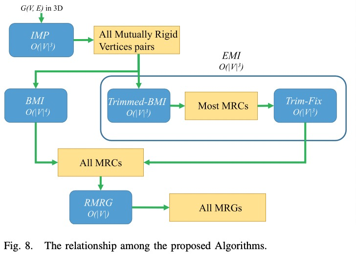
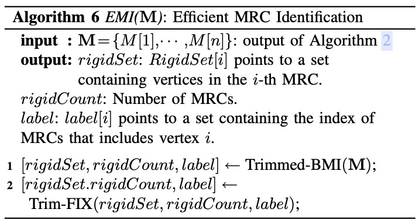
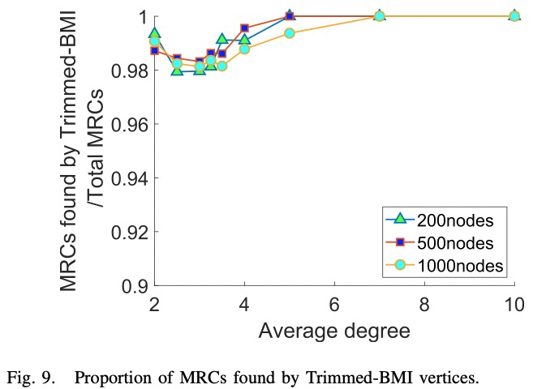
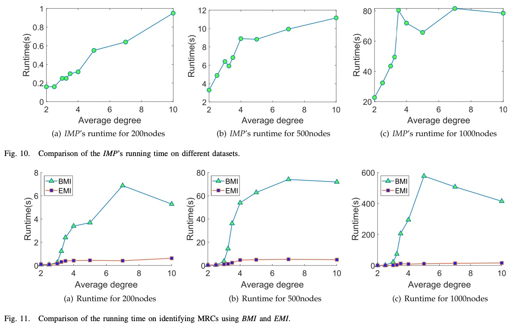
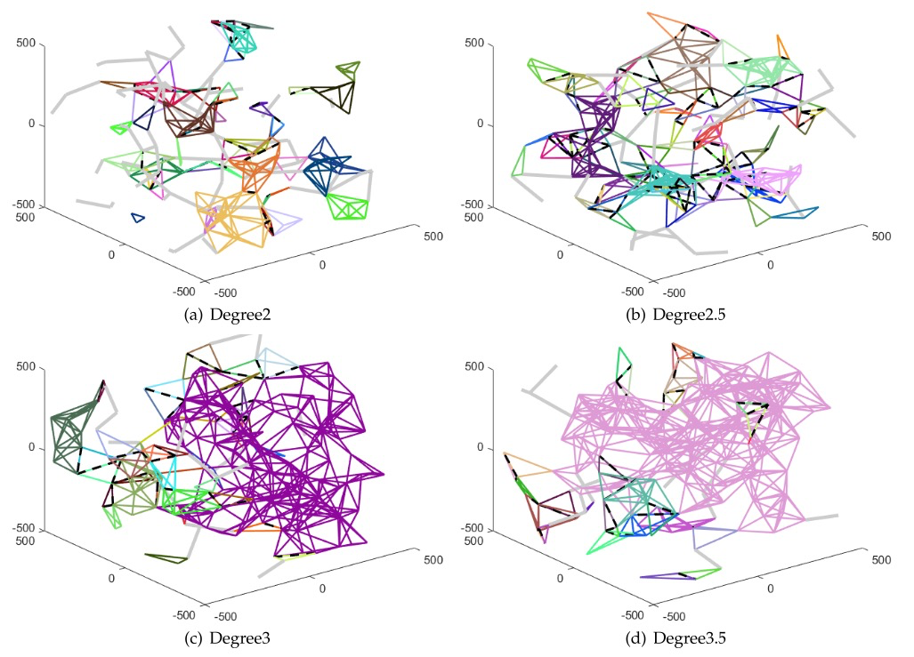

<h2 align = "center">
EMI: An Efficient Algorithm for Identifying Maximal Rigid Clusters in 3D Generic Graphs
</h2>
<h4 align = "center" >
<a href="https://ieeexplore.ieee.org/stamp/stamp.jsp?tp=&arnumber=10168053"> IEEE/ACM TRANSACTIONS ON NETWORKING, VOL. 32, NO. 1, FEBRUARY 2024 </a>
</h4>


Qianhan Wei, **Yongcai Wang\***, and Deying Li

School of Information, Renmin University of China, Beijing, 100872 

<center>
  <a href="EMI.pdf"> 
  </a>
  <a href="https://github.com/fdwqh/EMI-algorithm">
  
  </a>  
</center>


<h2 align = "center">
Overview 
</h2>
Identifying the Maximal Rigid subGraphs (MRGs) whose relative formations cannot deform continuously in Rd, is a fundamental problem in network formation control and network localization. When $d = 3$, it becomes extremely challenging and has been open for decades because the fundamental Laman condition doesn’t hold in $\Re^3$. This paper presents a new understanding of this problem. Because of the existence of “implicit hinges” in 3D, its essence should be to detect the **Maximal Rigid Clusters (MRCs)**. An MRC is a maximal set of vertices in which each vertex is mutually rigid to the others, but the vertices are not necessarily connected. We show that the MRGs in the original graph can be easily deduced from the connected components generated by the MRCs. For efficiently identifying the MRCs, at first, a randomized algorithm to detect mutually rigid vertex pairs is exploited. Based on this, a Basic MRC Identification algorithm (BMI) is proposed, which is an exact algorithm that can detect all MRCs based on the extracted rigid vertex pairs, but it has $O(|V |^4)$ time complexity. To further pursue an efficient algorithm, we observe the “hinge MRCs” appear rarely. So **an Efficient framework for MRC Identification (EMI)** is proposed. It consists of two steps: 1) a Trimmed-BMI algorithm that guarantees to detect all simple MRCs and may miss only hinge MRCs; 2) a Trim-FIX algorithm that can find all hinge MRCs. We prove EMI can guarantee to detect all the MRCs as accurately as BMI, using $O(|V |^3)$ times. Further, we show EMI achieves magnitudes of times faster than BMI in experiments. Extensive evaluations verify the effectiveness and high efficiency of EMI in various 3D networks. We have uploaded the code of the related program to https://github.com/fdwqh/EMI-algorithm.

<h2 align = "center">
Motivation
</h2>
The invalidity of Laman theorem in $\Re^3$ is mainly caused by the “implicit hinges” [9] in $\Re^3$ which doesn’t appear in $\Re^2$. If two MRCs have only two vertices in common, the line segment generated by the two vertices forms a “hinge”. The two MRCs can rotate around the hinge. If there isn’t an edge between the two vertices, it is called an “implicit hinge”.


<h2 align = "center">
Contributions
</h2>

- A new understanding to the MRG detection problem in $\Re^3$. We show the essence is to detect MRCs. The MRGs can be deduced by a recursive algorithm to find the rigid connected components of the graphs induced by the MRCs.
- We design a random number-based, $O(|V|^3)$ time algorithm that can find all mutually rigid vertex pairs in an undirected generic graph in $\Re^3$.
- On the premise of knowing the information of the mutual rigid vertex pairs, and based on the property of MRCs in $\Re^3$ that two MRCs have at most two vertices in common, we design an $O(|V|^4)$  time, exact algorithm that can find all MRCs in undirected generic graphs in $\Re^3$​.
- Although all MRCs can be found by BMI, the efficiency is still not satisfied. For this reason, an efficient framework, i.e., EMI is proposed. EMI is composed by a Trimmed-BMI step and a Trim-FIX step. We prove EMI can detect MRCs as accurately as BMI and prove its time complexity is $O(|V|^3)$. Experiments in different datasets show that EMI is magnitudes of times faster than BMI.

<h2 align = "center">
Main Algorithms
</h2>
1.   We first consider the problem to **identify mutually rigid vertex pairs** in a given 3D generic graph. 

     1.   Step1: we randomly generate a framework $p(G)$ and derive its rigid matrix $R$, then we calculate the null space of $R$ and get $\overrightarrow{V^*}$ by a random linear combination of the null space basis vectors of $R$​. This generates random velocity vectors that satisfy the existing edge constraints.
     2.   Step2: For any vertex pair $(i, j)$, we then calculate $\delta_{i j}=$ $\left(\overrightarrow{p_i}-\overrightarrow{p_j}\right) \cdot\left(\overrightarrow{v_i}-\overrightarrow{v_j}\right)$
     3.   We repeat Step1 and Step2 to generate several frameworks with different vertex positions and repeat the above process on each framework. For each vertex pair $i, j$, only when $\delta_{i j}$ obtained from different frameworks are all less than a threshold $T_{\text {cutoff }}$, e.g., $10^{-3}$, then it is considered that $i$ and $j$​ are mutually rigidity.

2.   BASIC MRC IDENTIFICATION (BMI)， Based on the identified mutually rigid pairs, we propose a Basic MRC Identification (BMI) algorithm.

     

3.   EFFICIENT MRC IDENTIFICATION: EMI






<h2 align = "center">
Evaluations
</h2>






<h2 align = "center">
BibTex
</h2>
```tex
@ARTICLE{10168053,
  author={Wei, Qinhan and Wang, Yongcai and Li, Deying},
  journal={IEEE/ACM Transactions on Networking}, 
  title={EMI: An Efficient Algorithm for Identifying Maximal Rigid Clusters in 3D Generic Graphs}, 
  year={2024},
  volume={32},
  number={1},
  pages={460-474},
  keywords={Fasteners;Electromagnetic interference;Rigidity;Clustering algorithms;Location awareness;Three-dimensional displays;Time complexity;Maximum rigid cluster partition;3D networks;rigid cluster;implicit hinge;mutual rigid pair},
  doi={10.1109/TNET.2023.3287822}}

```

<h2 align = "center">
Acknowledgment 
</h2>
This work was supported in part by the National Natural Science Foundation of China Grant 61972404 and Grant 12071478; in part by the Public Computing Cloud, Renmin University of China; and in part by the Blockchain Laboratory, Metaverse Research Center, Renmin University of China.


