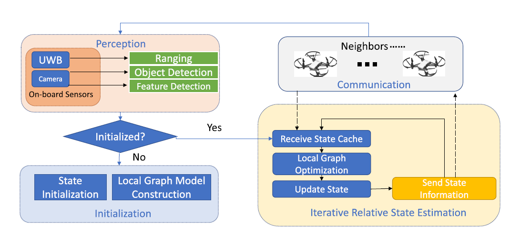
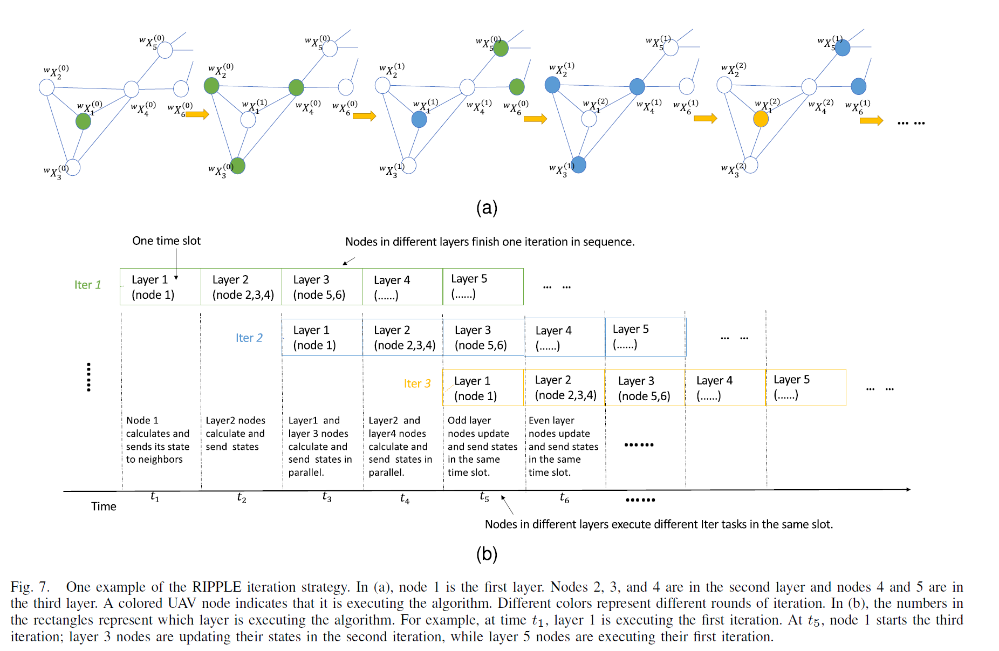
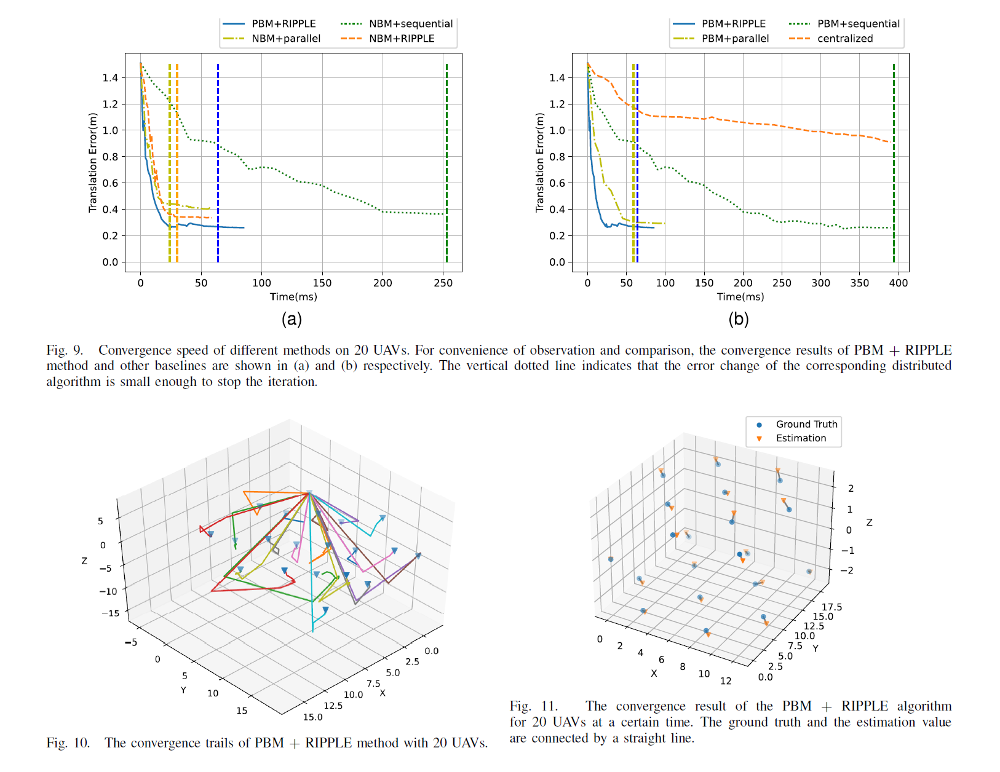
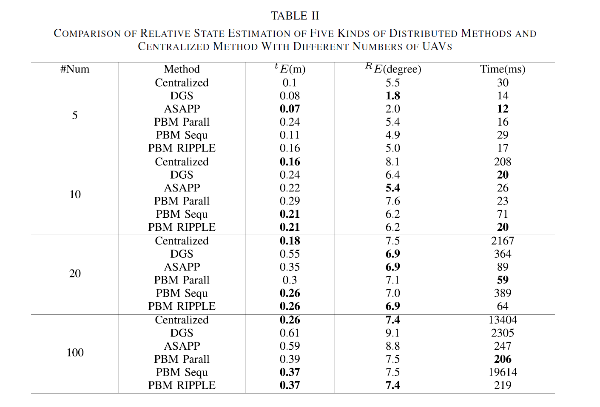
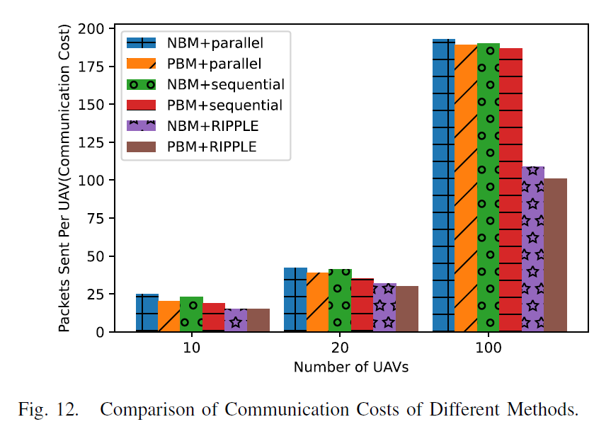
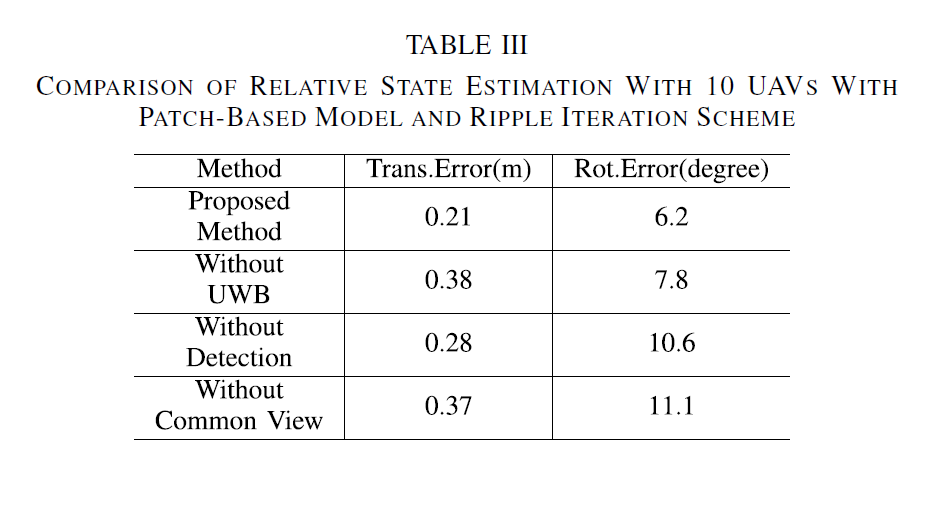
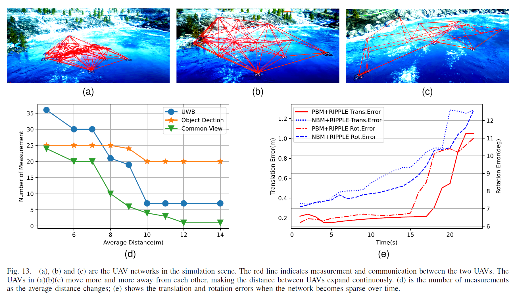

<h2 align = "center">
Communication Efficient, Distributed Relative State Estimation in UAV Networks
</h2>
<h4 align = "center" >
<a href="https://ieeexplore.ieee.org/abstract/document/10038530/"> IEEE Journal on Selected Areas in Communications  </a>
</h4>

Shuo Wang^1^, Yongcai Wang^1,*^,  Xuewei Bai^1^, Deying Li^1^

^1^ School of Information, Renmin University of China, Beijing, 100872 


<center>
  <a href="https://ieeexplore.ieee.org/abstract/document/10038530/"> 
  </a>
  <!-- <a href="#">
  
  </a>  
  <a href="#">
  
  </a>  -->
</center>


<video controls="controls" autoplay="autoplay" src="JSAC.mp4" type="video/mp4"></video>


<h2 align = "center">
Overview 
</h2>
Distributed estimation of 6-DOF relative states, including three-dimensional relative poses and three-dimensional relative positions, is a key problem in UAV (Unmanned Aerial Vehicle) networks, which generally requires vision-involved iterative state estimation. How to achieve communication efficiency is a crucial challenge considering the large volume of vision data. This paper jointly considers the communication efficiency, latency, and accuracy for distributed relative state estimation involving vision data in UAV networks. The key is to solve a distributed graph optimization problem, which includes two key steps: (1) local graph construction and node state initialization in an initialization phase, and (2) iterative state update and communication with neighbors until convergence in online iteration phase. A communication efficient, Locating Then Informing (LTI) initialization scheme is proposed, which is run only once by each node to initialize each node’s local graph and initial states. For online iteration, a RIPPLE-like distributed state iteration scheme is proposed. It inherits the advantages of traditional sequential and parallel methods while avoiding their drawbacks. It enables nodes’ states to converge quickly using fewer rounds of communications. The communication costs for the initialization and online iteration processes are analyzed
theoretically. Extensive evaluations use synthetic data generated by AirSim (a widely used UAV network simulation platform) and real-world data are presented. The results show that the proposed method provides accuracy comparable to the centralized graph
optimization method and significantly outperforms the other distributed methods in terms of accuracy, communication cost, and latency.

<h2 align = "center">
System Architecture 
</h2>
The main pipeline for one UAV. Each UAV collects the data from the sensors onboard. If it is not initialized, it enters an initialization phase (IV-B). If it has already been initialized, the UAV collects the states of neighbors and performs local graph optimization. The results are utilized to update its own state and broadcast to neighbors. Through iteration, the error is continuously reduced, and an accurate result is obtained.




<h2 align = "center">
Feature
</h2>


-   **Patch-based local graph optimization model (PBM)**: Using UWB as the inter-UAV distance measurement module and the onboard camera for UAV detection and environment
feature point detection, a practical graph optimization model based on multiple feature fusion for UAV relative state estimation is introduced. In particular, a patch-based local graph optimization model (PBM) is proposed, which shows better performance than the traditional node-based local graph optimization model (NBM).

-   **Locating Then Informing (LTI) Initialization**: A Locating Then Informing (LTI) scheme is proposed for communication efficient state initialization. In LTI, after the neighbors of the root obtain their initial locations, they send their local measurements to neighbors. Then neighbors can start initialization. Eventually, all nodes obtain their initial states and construct their local optimization graphs, and each node sends data only once during this process.

-   **RIPPLE-like state update and propagation**: Then for online distributed state estimation, a RIPPLE-like state update and propagation method is proposed, which takes advantage of both the traditional sequential and parallel state updating schemes while avoiding their drawbacks. It helps the distributed graph optimization to converge both quickly and accurately.

-   **Communication**: We analyze the communication cost in state initialization and distributed iteration processes. The performances of the proposed PBM + RIPPLE scheme are compared with the centralized method and five other distributed methods by simulations conducted by AirSim  (a widely used UAV network simulation platform). The results show that PBM + RIPPLE provides localization accuracy close to the centralized method and outperforms the other distributed optimization methods regarding communication cost, latency, and accuracy.

<h2 align = "center">
Evaluations
<h2>














<h2 align = "center">
Bibtex
</h2>
```tex
@ARTICLE{10038530,
  author={Wang, Shuo and Wang, Yongcai and Bai, Xuewei and Li, Deying},
  journal={IEEE Journal on Selected Areas in Communications}, 
  title={Communication Efficient, Distributed Relative State Estimation in UAV Networks}, 
  year={2023},
  volume={41},
  number={4},
  pages={1151-1166},
  keywords={State estimation;Autonomous aerial vehicles;Feature extraction;Location awareness;Distributed databases;Distance measurement;Costs;Communication efficiency;distributed graph optimization;relative state estimation;UAV networks},
  doi={10.1109/JSAC.2023.3242708}}

```


<h2 align = "center">
Acknowledgment 
</h2>
This work was supported in part by the National Natural Science Foundation of China Grant No. 61972404, 12071478; Public Computing Cloud, Renmin University of China; Blockchain Laboratory, Metaverse Research Center, Renmin University of China.

The authors would like to thank the reviewers’ valuable suggestions to improve this work and also would like to thank Prof. Qianchuan Zhao of Tsinghua University for providing space and guidance in conducting the real-world experiments.


