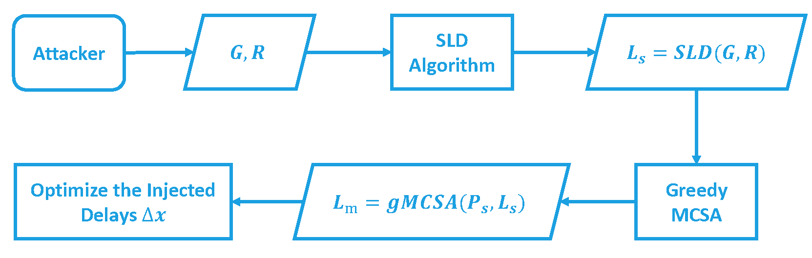
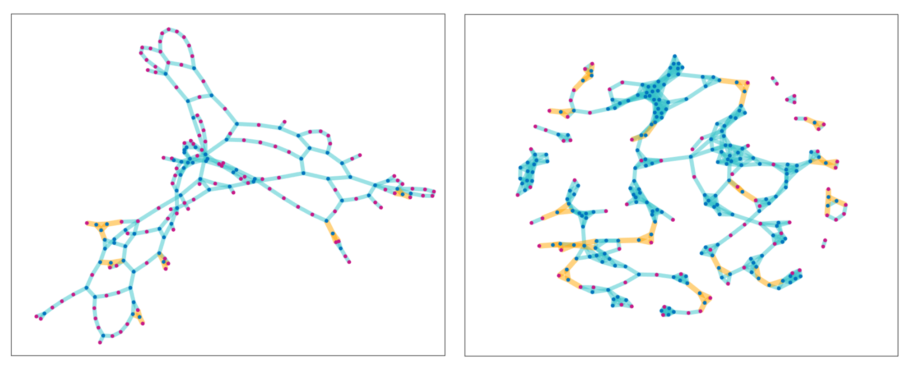
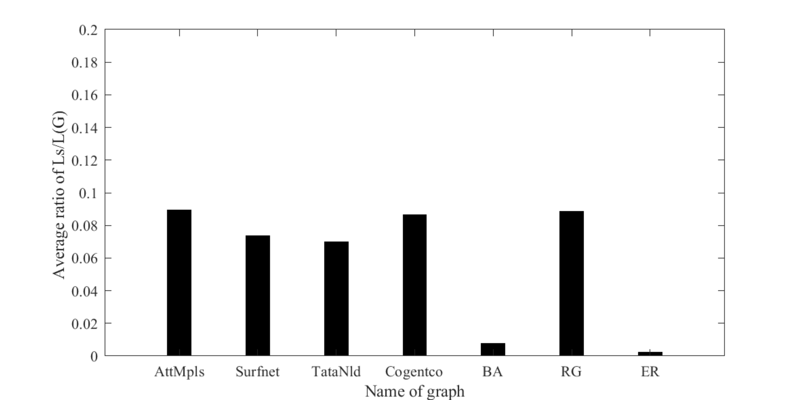
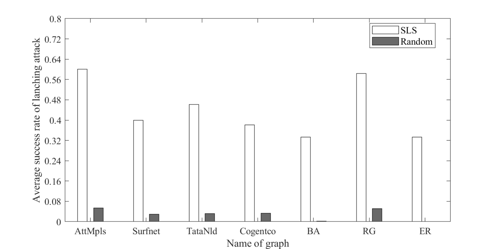

<h2 align = "center">
  <a href="https://ieeexplore.ieee.org/document/10109847">
    LSA: Understanding the Threat of Link-Based Scapegoating Attack in Network Tomography </a>
</h2>
<h4 align = "center" >
Proceedings of <a href="https://ieeexplore.ieee.org/document/10109847"> TNSE 2023 </a>
</h4>


Xiaojia Xu^1^, Yongcai Wang^1,*^,  Lanling Xu^1^, Deying Li^1^

^1^ School of Information, Renmin University of China, Beijing, 100872 

<center>
  <a href="LSA.pdf"> 
  </a>
</center>

<h2 align = "center">
Overview 
</h2>
Network tomography is a powerful and convenient tool to infer the internal states of a network via end-to-end path measurements. However, this article shows that when identifiability is not satisfied at all links (which is general in applications for cost saving purpose), a special kind of attack, i.e., link-based scapegoating attack (LSA) that can greatly degrade the network performance while misleading the network tomography to identify some normal links as problematic links can be launched. To fully understand the threat from LSA, this article in particular investigates the conditions and efficient methods to launch LSA from an attacker's point of view. Specifically, an efficient algorithm to figure out the potential scapegoat links is first proposed, and the conditions to launch LSA are presented. Then a minimum-cost scapegoating attack (MCSA) problem is proposed, which studies how to manipulate the least-cost link sets to launch LSA. A weighted set cover model and a greedy approximation algorithm are designed to solve MCSA problem, which is approached by a linear programming method with HK approximation ratio. Evaluation on both synthetic and real network topologies shows the wide existence of LSA threats, the feasibility of the proposed LSA conditions, and the attacking strategies.

<h2 align = "center">
The procedure
</h2>
Figure below summarizes the procedure of launching the scapegoating attack under the watch of network tomography.



<h2 align = "center">
Contribution
</h2>


-   **1)**: An efficient scapegoat link detection (SLD) algorithm is proposed to locate the potential scapegoat link set by a proposed Gaussian Elimination method in non-triconnected components. The algorithm is efficient even in large networks.
-   **2)**: A necessary condition and a sufficient condition to successfully launch LSA in network tomography and to mislead the network tomography to identify some normal links as scapegoats are presented.
-   **3)**: Then a minimum cost scapegoating attack (MCSA) problem is proposed, which studies how to manipulate the minimum cost link set to launch LSA successfully. A set cover model is proposed, and an approximation greedy algorithm with HK ratio is developed to solve MCSA.
-   **4)**: Extensive verifications on both real ISP network topologies and synthetic topologies show the wide existence of LSA threats, the effectiveness of the proposed LSA conditions and the attacking strategies.

<h2 align = "center">
Evaluations
<h2>






<h2 align = "center">
Bibtex
</h2>
```tex
@ARTICLE{10109847,
  author={Xu, Xiaojia and Wang, Yongcai and Xu, Lanling and Li, Deying},
  journal={IEEE Transactions on Network Science and Engineering}, 
  title={LSA: Understanding the Threat of Link-Based Scapegoating Attack in Network Tomography}, 
  year={2023},
  volume={10},
  number={6},
  pages={3670-3681},
  doi={10.1109/TNSE.2023.3271135}}

```


<h2 align = "center">
Acknowledgment 
</h2>
This work was supported by the National Natural Science Foundation of China under Grants 61972404 and 12071478.


