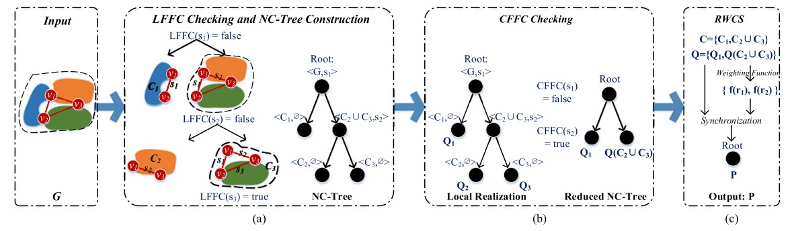
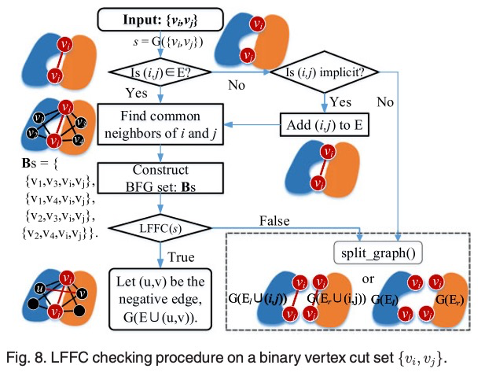
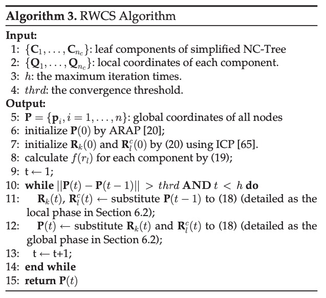
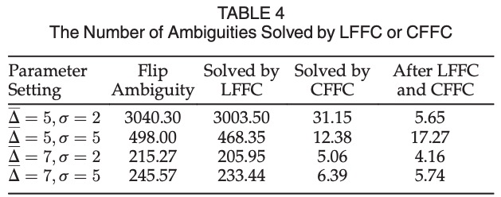
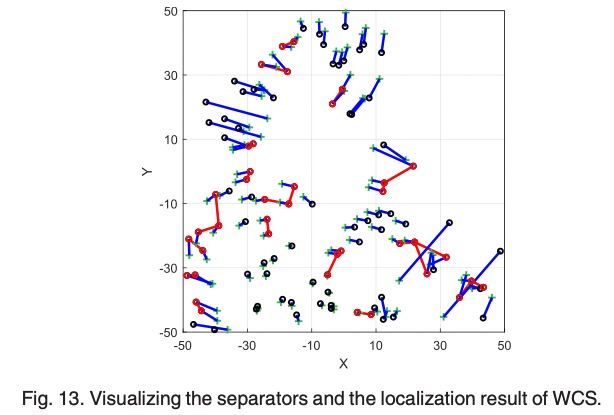
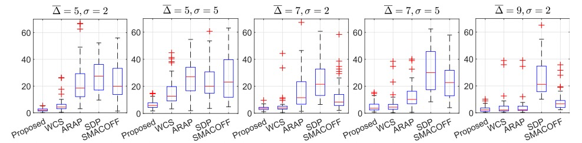

<h2 align = "center">
Flipping Free Conditions and Their Application in Sparse Network Localization
</h2>
<h4 align = "center" >
<a href="https://ieeexplore.ieee.org/stamp/stamp.jsp?tp=&arnumber=9165000"> IEEE TRANSACTIONS ON MOBILE COMPUTING, VOL. 21, NO. 3, MARCH 2022 </a>
</h4>


 Haodi Ping, **Yongcai Wang\***, Deying Li and Tianyuan Sun

School of Information, Renmin University of China, Beijing, 100872 

<center>
  <a href="flippingfree.pdf"> 
  </a>
</center>


<h2 align = "center">
Overview 
</h2>
Inferring network topology via inter-node distance measurements is an important problem. It is challenging when the distance measurements are sparse because the lack of edge constraints may lead to ambiguous realizations that differ greatly from the ground truth. The flipping ambiguities are caused by binary vertex cut sets in 2D and triple vertex cut sets in 3D, which are called separators. This paper investigates conditions on whether the flipping ambiguities caused by these separators can be disambiguated using neighborhood, full graph, and component-level conditions. Accordingly, **local flipping-free condition (LFFC)**, **global flipping-free condition (GFFC)**, and **component-based flipping free condition (CFFC)** are proposed. Then a disambiguating framework based on a combinatorial application of these conditions is proposed. It detects separators and first disambiguate separators locally by LFFC, which converts the graph to a binary tree, whose leaf nodes are flipping-free components and edges are LFFC unsolvable separators. Then the CFFC condition is further applied to disambiguate LFFC unsolvable separators between components. If k and g separators are disambiguated by LFFC and CFFC respectively, the number of ambiguous solutions for network localization will be reduced by 2kþg times. Finally, the flipping-free components realize node coordinates in their local coordinate systems and a **residue- based weighted component stitching algorithm (RWCS)** is proposed to iteratively synchronize components’ local coordinates to generate global coordinates of the network. Extensive simulations show the LFFC, CFFC and RWCS frameworks are efficient, which resolve a major portion of flipping ambiguities and greatly improve the localization accuracy than the state of art algorithms in various sparse network settings.

<h2 align = "center">
Motivation
</h2>

This paper studies the disambiguation problem, which is a key challenge in both network localization and graph realization. Localization and realization will be used inter- changeably since the realized structure can be transformed into the global coordinate system by selecting not less than $d- 1$ non-collinear nodes as anchors, where $d$ is the space dimension.

Solution uniqueness is a key challenge in graph realization, which requires the graph hasn’t other ambiguous realizations that also satisfy $D$. Note that rigid transformations, i.e., the global rotation, translation, and reflection don’t change the inner structure of a realization. Two realizations $P$ and $P_0$ of a graph are said ambiguous if their inter-node distances both satisfy $D$, but $P_0$ cannot be rigidly transformed to $P$.


<h2 align = "center">
Contributions
</h2>

- We first propose **basic flipping graphs (BFG)** in 2D and 3D, which are the minimum size graphs in which flip- ping ambiguity may happen. Then a **local flipping free condition (LFFC)** in BFGs is proposed, which can infer the exact length of the negative edge in the BFG, so that the flipping ambiguity of the BFG can be disambiguated with high probability. LFFC is a local condi- tion using one-hop neighborhood information. We show the advantages of LFFC than the traditional triangle inequality (TI) condition in resolving more flip- ping cases.
- Then we prove a **global flipping free condition (GFFC)** in the graph level. It proves that the $d-1$ connected generic graphs in $\Re^d$ are flipping-free for $d\in \{2,3\}$. So in a rigid graph, each $(d+1)$-connected component is flipping free. Flipping may happen only at the $d$​-vertex cut sets, which are called flipping separators. We further propose a **Component-based Flipping Free Condition (CFFC)** to determine whether flipping ambiguity may happen at a flipping separator.
- By utilizing CFFC and LFFC in combination, a flipping separator detection, LFFC checking, and **non-flipping tree (NC-Tree) construction method** is proposed. The algo- rithm starts by finding a flipping separator and checks LFFC on it. If LFFC is TRUE, the flipping ambiguity is eliminated and another flipping separator will be found and be checked. If LFFC is FALSE, the graph is separated into two sub-graphs by the flipping separator. The result of the algorithm partitions the network into a binary tree, called NC-Tree, whose leaf nodes are $(d+1)$​-connected non-flipping components and edges are unresolvable flipping separators. 
- CFFC condition is further applied on the NC-Tree to resolve LFFC unsolvable separators using the multi- hop geometrical condition. If $k$ and $g$ separators are resolved by LFFC and CFFC respectively, the number of ambiguous realizations of the network will be reduced by $2^{k+g}$ times. All feasible realizations can be inferred from the NC-Tree.
- At last, to generate a realization with better tolerance to ranging noises, a Residue-based **Weighted Component Stitching (RWCS) algorithm** is developed. It first calculates the local coordinates of each non-flipping components in their local coordinate frames. Then the local coordinates are synchronized by iterative rotation and transition until convergence to produce the global coordinates of the graph. We show by extensive simulations that the proposed LFFC, CFFC and RWCS framework resolves flipping ambiguities efficiently and improves the network realization accuracy greatly in sparse networks than the state of art algorithms in various network settings.

<h2 align = "center">
Main Algorithms
</h2>

1.   **Proposition 1 (Basic Flipping Graph: BFG)**. A four vertex, five edge component containing a flipping edge as shown in Fig. 2a, and five vertexes, nine-edge component containing a flipping face as shown in Fig. 2b are the simplest rigid graphs that may have flipping ambiguity, i.e., rigid graphs having the least number of vertices and edges that may have flipping ambiguity in $\Re^2$ and $\Re^3$ respectively.


2.   Main Theories: 


3.   System Architecture

     An overview of the proposed scheme using a graph of three separators as an instance.









<h2 align = "center">
Evaluations
</h2>











<h2 align = "center">
BibTex
</h2>
```tex
@ARTICLE{PingTMC2022,
  author={Ping, Haodi and Wang, Yongcai and Li, Deying and Sun, Tianyuan},
  journal={IEEE Transactions on Mobile Computing}, 
  title={Flipping Free Conditions and Their Application in Sparse Network Localization}, 
  year={2022},
  volume={21},
  number={3},
  pages={986-1003},
  keywords={Particle separators;Distance measurement;Mobile computing;Network topology;Synchronization;Optimization;Two dimensional displays;Network localization;negative edges;sparse networks;flipping free condition;tree of non-flipping components;component synchronization},
  doi={10.1109/TMC.2020.3015480}}
```

<h2 align = "center">
Acknowledgment 
</h2>
This work was supported in part by the National Natural Science Foundation of China Grant No. 61972404, 61672524, 11671400. The Fundamental Research Funds for the Central University, and the Research Funds of Renmin University of China, 2015030273.


