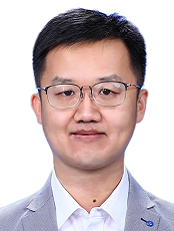

  

|      |  [English Version](index_en.html)   |
| ---- | ---: |

王永才，中国人民大学计算机系副教授，博士生导师，清华大学自动化系本科、博士，曾任 NEC研究院任副研究员，清华大学交叉信息研究院任助理研究员，康奈尔大学访问学者，是CCF智能机器人专委会执行委员、物联网专委会执行委员、中国控制学会DEDS专委会执行委员、SIGBED  China专委、CAAI认知与信息处理等专委会委员，主要研究领域为**智能体系统、视觉空间计算、Spatial AI、协同感知、SLAM、大图结构计算与挖掘**，在国内外知名期刊和会议发表论文120余篇，其中**CCF A，B类论文50余篇**。研究成果被应用于智能车、智能船、视觉目标检测与定位等领域。主持国家自然科学基金项目多项，国家科技支撑计划子课题，企业项目多项，**2021年由于海上目标定位工作获得交通运输部航海学会技术发明奖一等奖，2022年获得交通运输部航海学会科技进步二等奖，交通运输部重大创新成果入库成果奖**。担任NuerIPS, WWW, ACM MM, TON, TMC等知名期刊和会议审稿人。

**DBLP**论文目录：https://dblp.org/pid/04/2124.html

Email: ycw@ruc.edu.cn

Phone: 010-82500901

## 新闻 

-   Hongyu Sun and Haoyu Liu [win National Scholarship](http://info.ruc.edu.cn/xwgg/xygg/3ecb6d7b5ee748779d4097f78230592c.htm), Congratulations🎉. ⏱2024. 11. 8. 
-   [NeurIPS 2024](papers/neurips2024/Point_PRC.pdf) +1, Congratulations to Hongyu🎉.  ⏱2024.09.26
-   [SIGMOD 2025](papers/SIGMOD2025.pdf) +1, Congratulations to Xiaojia and Haoyu🎉. ⏱2024.08.02
-   [ACM Multimedia 2024](https://2024.acmmm.org)  +3, Congratulations to Zhe Huang, Shuo Wang, and Xudong🎉.  ⏱2024.07.26
-   [RoCo: Robust Cooperative Perception By Iterative Object Matching and Pose Adjustment](https://arxiv.org/html/2408.00257v1) is selected as ACM Multimedia 2024 Oral 3.97%, Congratulaitons to Zhe Huang, 🎉, 2024.07.26

## 主要研究方向

• 智能体系统、视觉空间计算、Spatial AI、协同感知、SLAM、大图结构计算与挖掘。

## 招生信息

•   招生类型：科研早培本科生、学硕、专硕、直博、普博、工程博士。

•   期望要求：学习能力强，英文听说读写能力好，编程能力强，自驱力强，对上述方向感兴趣，善于独立思考。

•   加分项目：有科研论文发表、投稿、或重要比赛获奖经历的优先。

•   联系方式：欢迎发送简历或自我介绍到：[ycw@ruc.edu.cn](mailto:ycw@ruc.edu.cn)，欢迎联系。 

## 代表性论文

• Hongyu Sun, Qiuhong Ke, Yongcai Wang, Wang Chen, Kang Yang, Deying Li, Jianfei Cai, [A Prompt Learning Based Regulation Framework for Generalizable Point Cloud Analysis](papers/neurips2024/Point_PRC.pdf), NeurIPS 2024, Vancouver Convention Center, Canada Dec. 10 - Dec. 15  ( **CCF A**) , **codes**: https://github.com/auniquesun/Point-PRC, [**poster**](papers/neurips2024/Point_PRC_poster.pdf)

• Xiaojia Xu, Haoyu Liu, Xiaowei Lv, Yongcai Wang, Deying Li, [An Efficient and Exact Algorithm for Locally h-Clique Densest Subgraph Discovery](papers/SIGMOD2025.pdf), SIGMOD International Conference on Management of Data (2025)  ( **CCF A**), **codes**:  https://github.com/Elssky/IPPV

• Zhe Huang, Shuo Wang, **Yongcai Wang***, Wanting Li, Deying Li, Lei Wang, [RoCo: Robust Cooperative Perception By Iterative Object Matching and Pose Adjustment](https://arxiv.org/html/2408.00257v1), ACM Multimedia 2024. (**Oral 3.97%， CCF A**), **codes**: https://github.com/HuangZhe885/RoCo

• Shuo Wang, **Yongcai Wang***, Zhimin Xu, Yongyu Guo, Wanting Li, Zhe Huang, Xuewei Bai, Deying Li, [GSLAMOT: A Tracklet and Query Graph-based Simultaneous Locating, Mapping, and Multiple Object Tracking System]() ACM Multimedia 2024. (**CCF A**) , **codes**: https://github.com/markinruc/GSLAMOT

• Xuedong Cai, Yongcai Wang, Lun Luo, Minhang Wang, Deying Li, Jintao Xu, Weihao Gu, Rui Ai, [PRISM: PRogressive dependency maxImization for Scale-invariant image Matching](https://www.arxiv.org/abs/2408.03598), ACM Multimedia 2024. ( **CCF A**), **codes**: https://github.com/Master-cai/PRISM

• Hualong Cao, **Yongcai Wang\***, Deying Li, [DMS: Low-overlap Registration of 3D Point Clouds with Double-layer Multi-scale Star-graph](DMS/DMS.pdf), **IEEE Transactions on Visualization and Computer Graphics**, 2024. doi: [10.1109/TVCG.2024.3400822](https://doi.org/10.1109/TVCG.2024.3400822) **(CCF A)** 

• Hongyu Sun, **Yongcai Wang\***, Peng Wang, Haoran Deng, Xudong Cai and Deying Li: [VSFormer: Mining Correlations in Flexible View Set for Multi-view 3D Shape Understanding](vsformer/VSFormer.pdf), **IEEE Transactions on Visualization and Computer Graphics**, 2024. **doi:** [10.1109/TVCG.2024.3381152](https://doi.org/10.1109/TVCG.2024.3381152) **(CCF A)** 

• Wanting Li, **Yongcai Wang\***, Yongyu Guo, Shuo Wang, Yu Shao, Xuewei Bai, Xudong Cai, Qiang Ye, Deying Li: [ColSLAM: A Versatile Collaborative SLAM System for Mobile Phones Using Point-Line Features and Map Caching](colslam/ColSLAM.pdf). **ACM Multimedia**, 2023, 9032-9041 https://doi.org/10.1145/3581783.3611995 **(CCF A)**  

• Qinhan Wei, **Yongcai Wang\***, Deying Li: [EMI: An Efficient Algorithm for Identifying Maximal Rigid Clusters in 3D Generic Graphs](EMI/EMI.pdf). **IEEE/ACM Transactions on Networking** 32(1), 460-474, 2024, **doi:** [10.1109/TNET.2023.3287822](https://doi.org/10.1109/TNET.2023.3287822) **(CCF A)** 

• Haoyu Liu, **Yongcai Wang\***, Xiaojia Xu, Deying Li: [Bottom-up k-Vertex Connected Component Enumeration by Multiple Extension](RIPPLE/RIPPLE.pdf), **ICDE** 2024, Utrecht Netherlands , May 13-17, 2024 (**CCF A**) 

•    Haodi Ping, **Yongcai Wang\***, Yu Zhang, Deying Li, Lihua Xie: [Understanding Hidden Knowledge in Generic Graphs](papers/Understanding.pdf) , in  **IEEE/ACM Transactions on Networking**, 2024. doi: [10.1109/TNET.2024.3364177](https://doi.org/10.1109/TNET.2024.3364177) **(CCF A)**

• Shuo Wang, **Yongcai Wang\***, Xuewei Bai, Deying Li: [Communication Efficient, Distributed Relative State Estimation in UAV Networks](JSAC2023/JSAC2023Wang.pdf) , in **IEEE Journal on Selected Area of Communications**, 2023. **doi:** [10.1109/JSAC.2023.3242708](https://doi.org/10.1109/JSAC.2023.3242708) **(CCF A)**

• Haodi Ping, **Yongcai Wang\***, Deying Li and Wenping Chen: [Understanding Node Localizability in Barycentric Linear Localization](localizability/Understanding.pdf), in **IEEE/ACM Transactions on Networking**, 2022, doi: 10.1109/TNET.2022.3216204. **(CCF A)** 

• Haodi Wang, **Yongcai Wang\***, Deying Li, Tianyuan Sun: [Flipping Free Conditions and Their Application in Sparse Network Localization](flippingfree/flippingfree.pdf), **IEEE Trans. on Mobile Computing**, 2022, Vol.21, No.3, 986-1003, **doi:** [10.1109/TMC.2020.3015480](https://doi.org/10.1109/TMC.2020.3015480) **(CCF A)** 

• Chuanwen Luo, Deying Li, **Yongcai Wang** , Wenping Chen, Weili Wu: [Fine-grained Trajectory Optimization of Multiple UAVs for Efficient Data Gathering from WSNs](finegrained/Fine-Grained.pdf), **IEEE/ACM Transactions on Networking**.2021, Vol.29, No.1, 162-175, **doi:** [10.1109/TNET.2020.3027555](https://doi.org/10.1109/TNET.2020.3027555) **(CCF A)**

• Zhixian Lei, Xuehan Ye, **Yongcai Wang\***, Deying Li, Jia Xu, [Efficient Online Model Adaptation by Incremental Simplex Tableau](papers/aaai-yc.pdf), **AAAI**, 2017,2161-2167, San Francisco, California, USA **(CCF A)**

• Xuehan Ye, Shuo Huang, **Yongcai Wang\***, Wenping Chen, Deying Li: [Unsupervised Localization by Learning Transition Model](papers/unsupervised_localization.pdf). **IMWUT** 3(2): 65:1-65:23 (2019) https://doi.org/10.1145/3328936 **(CCF A)**

• **Yongcai Wang\***, Tianyuan Sun, Guoyao Rao, Deying Li., [Formation Tracking in Sparse Airborne Networks](papers/jsac.pdf), **IEEE Journal on Selected Areas in Communications** **(JSAC)** 2018, Vol. 36, No.9, 2000-2014, **doi:**  [10.1109/JSAC.2018.2864374](https://doi.org/10.1109/JSAC.2018.2864374) **(CCF A)**

• Tianyuan Sun, **Yongcai Wang\***, Deying Li, Zhaoquan Gu, Jia Xu., [WCS: Weighted Component Stitching for Sparse Network Localization](papers/wcs.pdf), **ACM/IEEE Transactions on Networking (TON)**, 2018, Volume: 26 , Issue: 5 , Oct. 2018. **doi:** [10.1109/TNET.2018.2866597](https://doi.org/10.1109/TNET.2018.2866597)**（CCF A**）

• Xuehan Ye, **Yongcai Wang\***, Yuhe Guo, Wei Hu, Deying Li, [Accurate and Efficient Indoor Location by Dynamic Warping in Sequence Type Radio-map](papers/Ye-Ubicomp18.pdf), **Ubicomp**, Oct. 2018, Singapore. https://doi.org/10.1145/3191782**（CCF A**）

• **Yongcai Wang\***, Lei Song, S.S. Iyengar, [An Efficient Technique for Locating Multiple Narrow-band Ultrasound Targets in Chorus Mode](papers/chorus.pdf), **IEEE Journal on Selected Areas in Communications** **(JSAC)** , Vol. 33, No. 11, 2343 - 2356, 2015, **doi:**  [10.1109/JSAC.2015.2441379](https://doi.org/10.1109/JSAC.2015.2441379) **(CCF A)**

• Xiaohong Hao, Bangsheng Tang, **Yongcai Wang\***, [On the Balance of Meter Deployment Cost and NILM Accuracy](papers/ijcai.pdf). **IJCAI**, 2015, Buenos Aires, Argentina, 2603–2609, **(CCF A)**

• Xiao Qi, **Yongcai Wang\***, Yuexuan Wang, Liwen Xu, [Compressive Sensing over Strongly Connected Digraph and Its Application in Traffic Monitoring](papers/Compressive_sensing.pdf), **INFOCOM**, Toronto, ON, Canada, 2014 **(CCF A)**

• 蔡旭东，**王永才***，白雪薇，李德英: [基于先验地图的视觉重定位方法综述](papers/relocalization_survey.pdf). 《软件学报》, 2024, 35(2): 975-1009，DOI: [10.13328/j.cnki.jos.006946](http://dx.doi.org/10.13328/j.cnki.jos.006946) (**CCF** **中文**A类) 

• 殷晓航，**王永才***，李德英，[基于U-Net结构改进的医学影像分割技术综述](papers/Unet_survey.pdf)，《软件学报》，2020，http://www.jos.org.cn/1000-9825/6104.htm (**CCF** **中文**A类)

• 孙天元，**王永才***，李德英，[图实现算法综述与评测分析](papers/graph_realization_survey.pdf)，《自动化学报》， 46(4)，613-630，2020，**doi:**  [10.16383/j.aas.2018.c170561](https://dx.doi.org/10.16383/j.aas.2018.c170561) (**CCF** **中文**A类)

• Hongyu Sun, **Yongcai Wang\***, Wang Chen, Haoran Deng, Deying Li, [Parameter-efficient Prompt Learning for 3D Point Cloud Understanding](ppt/ppt.pdf), **ICRA 2024**, Yokohama May 13th to 17th（**CCF B**) 

• Peng Wang, **Yongcai Wang\***, Deying Li, [DroneMOT: Drone-based Multi-Object Tracking Considering Detection Difficulties and Simultaneous Moving of Drones and Objects](DroneMOT/DroneMOT.html), **ICRA 2024**, Yokohama, Japan, May 13-17, 2024（**CCF B**) 

• Xudong Cai, **Yongcai Wang\***, Zhe Huang, Yu Shao, Deying Li, [VOLoc: Visual Place Recognition by Querying Compressed Lidar Map](VOLoc/VOLoc.pdf), **ICRA 2024**, Yokohama May 13th to 17th（**CCF B**) 

• Xuewei Bai, **Yongcai Wang\***, Haodi Pin, Xiaojia Xu, Deying Li, Shuo Wang: [InferLoc: Hypothesis-Based Joint Edge Inference and Localization in Sparse Sensor Networks](papers/InferLoc.pdf). **ACM Trans. Sens. Networks** 20(1): 8:1-8:28 (2024)（**CCF B**)

• Hongyu Sun, **Yongcai Wang\***, Xudong Cai, Xuewei Bai, Deying Li: [ViPFormer: Efficient Vision-and-Pointcloud Transformer for Unsupervised Pointcloud Understanding](vipformer/vipformer.pdf). **ICRA 2023**: 7234-7242 （CCF B) 

• Zhe Huang, **Yongcai Wang\***, Jie Wen, Peng Wang, Xudong Cai: [An object detection algorithm combining semantic and geometric information of the 3D point cloud](papers/object_detection.pdf). **Adv. Eng. Informatics** 56: 101971 (2023)（**CCF B**)

• Wanting Li, **Yongcai Wang\***, Deying Li, Xiaojia Xu: [A robust map matching method by considering memorized multiple matching candidates](papers/mapmatching.pdf). **Theor. Comput.** Sci. 941: 104-120 (2023)（**CCF B**)

• Guoyao Rao, Deying Li, **Yongcai Wang**, Wenping Chen, Chunlai Zhou, Yuqing Zhu: [Maximizing the influence with *κ*-grouping constraint](papers/IM-k-grouping.pdf). **Inf. Sci.** 629: 204-221 (2023)（**CCF B**)

• Guoyao Rao, Deying Li, **Yongcai Wang**, Wenping Chen, Chunlai Zhou, Yuqing Zhu: [Online conflict resolution: Algorithm design and analysis](papers/online-conflict.pdf). **Inf. Sci.** 651: 119718 (2023)（**CCF B**)

• Xiaojia Xu, **Yongcai Wang\***, Yu Zhang, Deying Li: [A fault diagnosis method to defend scapegoating attack in network tomography](Defend/Defend.pdf). **Theor. Comput. Sci.** 939: 237-249 (2023)（**CCF B**)  

• Yu Zhang, Qinhan Wei, **Yongcai Wang\***, Haodi Ping, Deying Li: [GPART: Partitioning Maximal Redundant Rigid and Maximal Global Rigid Components in Generic Distance Graphs.](papers/TOSN_2023_GPART.pdf) **ACM Trans. Sens. Networks** 19(4): 86:1-86:26 (2023) （**CCF B**)  

• Haodi Ping, **Yongcai Wang\***, Xingfa Shen, Deying Li, Wenping Chen:
 [On Node Localizability Identification in Barycentric Linear Localization](papers/Node_Localizability.pdf). **ACM Trans. Sens. Networks** 19(1): 19:1-19:26 (2023)（**CCF B**)

• Guoyao Rao, **YongcaiWang**, Wenping Chen, Deying Li, Weili Wu: [Union acceptable profit maximization in social networks](papers/Rao_TCS.pdf). **Theor. Comput. Sci.** 917: 107-121 (2022)（CCF B）

• Xiujuan Zhang, **YongcaiWang**, Deying Li, Wenping Chen, Xingjian Ding: [Self-stabilizing spanner topology control solutions in wireless ad hoc networks](papers/ZhangTCS22.pdf). **Theor. Comput. Sci.** 922: 395-409 (2022)（**CCF B**）

• Wenshuang Song, Yanhe Gong, **Yongcai Wang\***: [VTONShoes: Virtual Try-on of Shoes in Augmented Reality on a Mobile Device](VTONShoes.pdf). **ISMAR 2022**: 234-242 （**CCF B**)

• Xingfa Shen, Chuang Li, Weijie Chen, **YongcaiWang**, Quanbo Ge: [Transition Model-driven Unsupervised Localization Framework Based on Crowd-sensed Trajectory Data](papers/TOSN_2022_Shen.pdf). **ACM Trans. Sens. Networks** 18(2): 26:1-26:21 (2022)（**CCF B**)

• Ruidong Yan, Yi Li, Deying Li, **Yongcai Wang**, Yuqing Zhu, Weili Wu: [A Stochastic Algorithm Based on Reverse Sampling Technique to Fight Against the Cyberbullying](TKDD_2021_Yan.pdf). **ACM Trans. Knowl. Discov. Data** 15(4): 71:1-71:22 (2021)（**CCF B**)

• Guoyao Rao, **Yongcai Wang**, Wenping Chen, Deying Li, Weili Wu: [Matching influence maximization in social networks](papers/Matching_influence_maximization.pdf). **Theor. Comput. Sci.** 857: 71-86 (2021)（**CCF B**）

• Xingjian Ding, **Yongcai Wang**, Guodong Sun, Chuanwen Luo, Deying Li, Wenping Chen, Qian Hu: [Optimal charger placement for wireless power transfer](papers/CN-Ding-2020.pdf). **Comput. Networks** 170: 107123 (2020) (**CCF B**)

• Xingjian Ding, Wenping Chen, **Yongcai Wang**, Deying Li, Yi Hong: [Efficient scheduling of a mobile charger in large-scale sensor networks](papers/tcs-DING-2020.pdf). **Theor. Comput. Sci.** 840: 219-233 (2020) （**CCF B**）

• Ruidong Yan, Yi Li, Weili Wu, Deying Li, **Yongcai Wang**: [Rumor Blocking through Online Link Deletion on Social Networks](papers/1-TKDD-yan-2019.pdf). **TKDD** 13 (2): 16:1-16:26 (2019) (**CCF B**)

• **Yongcai Wang\***, Haisheng Tan, Distributed probabilistic routing for sensor network lifetime optimization. **Wireless Networks** 22(3): 975-989 (2016) (**CCF B**)

• Jiang Wang, Yuqing Zhu, Deying Li, Wenping Chen, **Yongcai Wang**, [Joint User Attributes and Item Category in Factor Models for Rating Prediction](papers/dasfaa.pdf). **DASFAA** (2016): 277-296 (**CCF B**)

• Xuehan Ye, **Yongcai Wang\***, Wei Hu, Lei Song, Zhaoquan Gu, Deying Li, WarpMap: Accurate and Efficient Indoor Locating by Dynamic Warping in Sequence-type Radio-map, (**SECON2016**), 2016. (**CCF B**)

• **Yongcai Wang\***, Lei Song, Zhaoquan Gu, Deying Li, [IntenCT: Efficient Multi-Target Counting and Tracking By Binary Proximity Sensors](papers/intenct.pdf), (**SECON2016**), 2016 (**CCF B**)

• Lei Song, **Yongcai Wang\***: [Multiple Target Counting and Tracking using Binary Proximity Sensors: Bounds, Coloring, and Filter](mobihoc14.pdf), （**MOBIHOC 2014**） (**CCF B**)

• Lei Song, **Yongcai Wang***: [Locating Multiple Ultrasound Targets in Chorus](papers/Secon14.pdf), （**SECON 2014**） (**CCF B**) 

• **Yongcai Wang\***, Xiaohong Hao, Lei Song, et al. [Monitoring Massive Appliances by a Minimal Number of Smart Meters](papers/TECS-wang.pdf), **ACM TRANS. ON EMBEDED COMPUTING SYSTEMS,**（TECS**）Vol. 13 Issue 2s, January 2014 (**CCF B)

• Tongyang Li, **Yongcai Wang\***, Lei Song, Haisheng Tan, [On Target Counting by Sequential Snapshots of Binary Proximity Sensors](papers/Li-EWSN-2015.pdf). （**EWSN 2015**）: 19-34 (**CCF B**)

• Yupeng Li, Haisheng Tan, **Yongcai Wang**, Zhenhua Han, Francis C. M. Lau: [Selfish task-driven routing in hybrid networks](papers/selfishrouting15.pdf). （**WiOpt 2015**）: 387-394 (**CCF B**)

## 教学

[《算法设计与分析II荣誉课程》](http://123.56.110.195:8320/c/algorithm/6), 2021-至今 

《机器感知：无人车和机器人是如何感知世界的？》新生研讨课，2023-至今

[《机器感知》](http://123.56.110.195:8320/c/robot-perception/5)，研究生专业课，2019-至今

《机器感知技术基础》，本科生选修课，2022-至今

[《运筹学建模与算法》](http://123.56.110.195:8320/c/optimization/7)，2016-至今

《图优化与Graph SLAM》，短期课程

《普适计算》, 2016, 2017, 2018

## 项目

《动态复杂场景下移动机器人环境定位感知研究》，企业横向项目，项目负责人， 11/2022-11/2023

《高精点云地图构建与视觉定位导航方法研究》，公安部重点实验室开放课题，项目负责人，01/2023-12/2023

《基于视觉的机场飞鸟检测系统》，企业横向课题，项目负责人，01/2022-12/2023

《基于模块拼接的群智SLAM关键问题研究》，国家自然科学基金面上项目，项目负责人，(No. 61972404), 1/2020-12/2023

《无人智能船的辅助驾驶决策系统》，交通部国家科技支撑计划子课题，项目负责人，09/2019-12/2022

《紧耦合多源同步定位与地图构建的融合优化关键问题研究》，国家自然科学基金，项目负责人，（No.62672524），01/2017-12/2020

《国家科技支撑计划课题-人员活动检测传感装置加工合同》，子课题项目负责人，(No. 2014BAK12B06)，01/2016-12/2016

《基于随身传感大数据的用户瞬时状态分析与特征分类》，人民大学新教师启动项目，项目负责人，（No.2015030273）,01/2016-12/2018

《稀疏多元传感器网络跟踪用电设备状态的序列解码与部署优化关键问题研究》, 国家自然科学青年基金，项目负责人，(No. 61202360), 01/2013-12/2015

《基于序优化的大规模无线定位与自标定方法研究》,教育部博士点基金，项目负责人，(No. 20120002120003), 01/2013-12/2014 .

《基于智能感知的智能生活》,与NEC研究院国际合作项目，项目负责人，(No. 041902003), 01/2013-12/2014.

《结合压缩采样与网络编码的无线传感器网络负载均衡与节能关键技术研究》,国家自然科学基金，项目骨干，(No.61073174), 01/2011- 12/2013

## 学术服务

[中国计算机学会智能机器人专委会](https://www.ccf.org.cn/Chapters/TC/TC_Listing/TCIR/)委员

[中国控制学会会员DEDS专委会](http://tcct.amss.ac.cn/)委员

[中国人工智能学会青年工作委员会](https://www.caai.cn/)委员

[中国计算机学会会员](https://www.ccf.org.cn/)

ValueTools 2021，Publicity Chair（宣传主席）

Sensors （CCF C类期刊）, Guest editor

ICNT2022 程序委员会委员

ICNCC2019（International Conference on Networks, Communication and Computing2019）,程序委员会委员

BDML2019(Intl Conf. on Bigdata and Machine Learning 2019)，程序委员会委员

CASE 2016，Session Chair

CASE 2017, Session Chair

CWSN 2011，Demo session Chair

CWSN 2013，程序委员会委员

IThings 2013，程序委员会委员

Reviewer for IEEE Trans. on Distributed Systems, ACM Transactions on sensor networks, Ad-hoc Sensor Wireless Networks, China Science F, IEEE Trans. on Signal Processing, CWSN, ICNSC, ITings etc.

## 获奖

2024年，中国人民大学优秀硕士毕业生指导教师

2023年，中国人民大学信息学院优秀教职工党员

2022年，中国人民大学信息学院科研先进个人

2022年，中国航海学会科学技术进步二等奖

2021年，中国航海学会技术发明一等奖

2020年，交通部中国交通运输重大科技创新成果，成果编号2020LW043

2020年，全国人工智能教学实践案例大赛二等奖

2020年，中国人民大学十佳班主任

2019年，中国人民大学优秀硕士毕业生指导教师

2019年，中国人民大学优秀班主任

2019年，中国人民大学本科教学优秀奖

2019年，ICNCC2019 最佳会议报告奖

2019年，中国人民大学优秀研究生毕业生指导教师

2018年，中国人民大学信息学院科研先进个人

2011年，CWSN（中国传感器网络大会）最佳论文奖

2009年，Ubicomm (国际普适计算与通信大会) 最佳论文奖

## 教育和工作背景

[清华大学自动化系](https://www.au.tsinghua.edu.cn/)，本科

[清华大学自动化系](http://cfins.au.tsinghua.edu.cn/)，直博

[NEC中国研究院](https://cn.nec.com/zh_CN/research/research_areas/index.html)，副研究员

[清华大学交叉信息研究院](http://iiis.tsinghua.edu.cn)，博士后

[清华大学交叉信息研究院](http://iiis.tsinghua.edu.cn)，助理研究员

[美国康奈尔大学](http://www.cornell.edu)，访问学者

[中国人民大学信息学院](http://info.ruc.edu.cn/)，副教授

## 闲暇爱好

爬山，羽毛球，跑步，做美食等

<a href="https://beian.miit.gov.cn/" target="_blank">网站备案号</a>
<a href="https://beian.miit.gov.cn/" target="_blank">京ICP备2024071883号</a>

