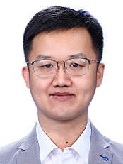

 

|      |  [中文版](index.html)  |
| ---- | :--- |

**Wang Yongcai** is a Professor and Doctoral Supervisor at the School of Computer Science, Renmin University of China. He also serves as Deputy Chair of the Department of Computer Science and Director of the Research & Discipline Construction Working Committee of the School of Information.

He received his bachelor’s and doctoral degrees both from the Department of Automation, Tsinghua University. **His primary research interests include agent systems, machine vision, Spatial AI, collaborative perception and multi-agent reinforcement learning. He has authored over 120 papers in top-tier domestic and international journals and conferences, among which more than 60 are published in CCF Rank A and B venues.** His research achievements have been applied to intelligent vehicles, intelligent ships, visual object detection and localization and other practical fields.

He has presided over multiple projects funded by the National Natural Science Foundation of China, sub-projects of the National Science and Technology Support Program, and numerous industrial research projects. **He was awarded the First Prize of Technical Invention by the China Institute of Navigation, Ministry of Transport in 2021 for his research on maritime target localization, the Second Prize of Science and Technology Progress and the Major Innovative Achievement Inclusion Award from the same institute in 2022, and the Third Prize of Science and Technology Progress in Petroleum and Chemical Automation in 2026.**

Professor Wang currently holds concurrent academic positions including Executive Member of the CCF Technical Committee on Intelligent Robotics and Internet of Things, Executive Member of the DEDS Technical Committee of Chinese Association of Automation, Member of SIGBED China Committee and CAAI Technical Committee on Cognition and Information Processing. He has served as a Program Committee Member for academic conferences including CIKM 2025, WWW 2025 and AAAI 2026. Additionally, he acts as an editorial board member for *Computer Science and Technology* and *International Journal of Robotics and Automation Technology*.

DBLP:   https://dblp.org/pid/04/2124.html

Email: [ycw@ruc.edu.cn](ycw@ruc.edu.cn)

## News 

-   ==**NEW**:== Recent report in Chinese. 

    >   ⏱2026. 04. 25. [具身导航与三维重建的发展与交叉]()，WISE2026，澳门科技大学创新工程系十年庆典活动
    >
    >   ⏱2025. 09. 07. [3D视觉 SLAM 技术前沿与进展](report/3D视觉 SLAM 的前沿与进展.pdf)，CWSN2025，低空经济论坛专题报告
    >
    >   ⏱2024. 12. 08. [智能航运感知数据集整理](report/智能航运感知数据集整理.pdf),  2024人工智能与自主式交通国际学术会议
    >
    >   ⏱2024. 12. 04. [多智能体协同感知研究进展](report/多智能体协同感知研究进展.pdf),  中国人民大学计算机系第十届学术节
    >
    >   ⏱2024. 10. 28. [视觉里程计从图优化到深度学习优化的发展](report/VIO_from_graph_to_deep_learning.pdf), 中国自动化学会DEDS专委会报告
    >
    
-   ⏱2026.05.01. [ICML](https://arxiv.org/abs/2602.00222)+1，Congratulations to Guoxin Lian🎉.

-   ⏱2026.03.22. [TVCG](https://ieeexplore.ieee.org/document/11456202/media#media)+1, Congratulations to Xudong Cai🎉. 

-   ⏱2026.02.21. [CVPR2026](https://cvpr.thecvf.com)+2, Congratulations to Peng Wang and Shuo Wang🎉. 

-   ⏱2026.01.31. [ICRA2026](https://2026.ieee-icra.org)+2,  Congratulations to Shuai Liu and Kang Yang🎉. 

-   ⏱2025.11.08. [AAAI 2026](https://aaai.org/conference/aaai/aaai-26/)+2, Congratulations to Xudong Cai and Shuo Wang🎉.  

-   ⏱2025.09.19. [NeurIPS 2025](https://neurips.cc)+2, Congratulations to Xuewei Bai and Shuo Wang🎉.  

-   ⏱2025.06.26. [ICCV2025](https://iccv.thecvf.com)+1, Congratulations to Peng Wang🎉.  

-   ⏱2025.06.25. TOSN+1，Congratulations to Xuewei🎉.

-   ⏱2025.04.23. ICMR+1，Congratulations to Yance🎉. 

-   ⏱2025.02.26. CVPR2025+2, Congratulations to Hongyu and Shuo🎉.

 
Early News

   ⏱2025.04.09. ADVEI+1，Congratulations to Zhe Huang🎉.  

  ⏱2025.01.28. ICRA2025 +1, Congratulations to Kang🎉.  

  ⏱2025.01.20. WWW2025 +1, Congratulations to Xiaowei🎉.

  ⏱2024.11.28. TVCG +1,  Congratulations to Hualong🎉.  

  ⏱2024. 11. 8.  Hongyu Sun and Haoyu Liu win National Scholarship, Congratulations🎉. 

  ⏱2024.09.26. NeurIPS 2024 +1, Congratulations to Hongyu🎉.  

  ⏱2024.08.02. SIGMOD 2025 +1, Congratulations to Xiaojia and Haoyu🎉. 

  ⏱2024.07.26. ACM Multimedia 2024 +3, Congratulations to Zhe Huang, Shuo Wang, and Xudong🎉.  

  ⏱2024.07.26. RoCo: Robust Cooperative Perception By Iterative Object Matching and Pose Adjustment is selected as ACM Multimedia 2024 Oral 3.97%, Congratulaitons to Zhe Huang, 🎉

  ⏱2024.05.06.  TVCG +1 , Congratulations to Hualong🎉.  

  ⏱2024.03.20.  TVCG +1,  Congratulations to Hongyu🎉. 

  ⏱2024.02.05. TON+1, Congratulations to Haodi🎉 

  ⏱2024.01.29. ICRA2024 +1,  Congratulations to Hongyu🎉 

 ⏱2024.01.29. ICRA2024 +1,  Congratulations to Wang Peng🎉.

 ⏱2024.01.29. ICRA2024 +1, Congratulations to Xudong🎉.

 ⏱2023.12.08, ICDE2024 +1,  Congratulations to Haoyu🎉. Codes are released. https://github.com/Elssky/RIPPLE

 ⏱2023.06.21, TOSN+1,  Congratulations to Xuewei🎉

 ⏱2023.06.11, TON+1,  Congratulations to Qinhan🎉 

## Teaching

-   ["Machine Perception"](https://v63s64hxao.feishu.cn/wiki/space/7424013477947703299?ccm_open_type=lark_wiki_spaceLink&open_tab_from=wiki_home) , Graduate Professional Course 
    
    >   [Course materials, including lecture notes、assignments、must read papers、recommended papers on FeiShu](https://v63s64hxao.feishu.cn/wiki/space/7424013477947703299?ccm_open_type=lark_wiki_spaceLink&open_tab_from=wiki_home)
    
-   ["Algorithm Design and Analysis II Honors Course"](https://url.v.tencent.com/WchOIaoU ), Undergraduate Course
-   "Operations Research Modeling and Algorithms," , Undergraduate Course
-   "Graph Optimization and Graph SLAM," Short-Term Course
-   "Ubiquitous Computing," 2016, 2017, 2018

## Main Research Directions

• Intelligent agent systems
• Visual spatial computing
• Spatial AI
• Collaborative perception
• SLAM (Simultaneous Localization and Mapping)
• Large-scale graph computation and mining

## Student Admission Information 

• **Student Types**: Research-oriented undergraduate early talent, Master's (both academic and professional), Direct Ph.D., Ph.D., and Engineering Ph.D.

• **Requirement and Expectation**: Strong learning ability, proficient in English (listening, speaking, reading, writing), strong programming skills, self-driven, keen interest in the above-mentioned research directions, adept at independent thinking.

• **Bonus Points**: Priority given to candidates with research paper publications, submissions, or significant competition awards.

• **Contact**: Please feel free to send your resume or self-introduction to [ycw@ruc.edu.cn](mailto:ycw@ruc.edu.cn). I look forward to hear from you.

## Representative Publications

#### **2026**

**[ICML]** [Guoxin Lian](https://arxiv.org/search/cs?searchtype=author&query=Lian,+G), [Shuo Wang](https://arxiv.org/search/cs?searchtype=author&query=Wang,+S), [Yucheng Wang](https://arxiv.org/search/cs?searchtype=author&query=Wang,+Y), [Yongcai Wang](https://arxiv.org/search/cs?searchtype=author&query=Wang,+Y), [Maiyue Chen](https://arxiv.org/search/cs?searchtype=author&query=Chen,+M), [Kaihui Wang](https://arxiv.org/search/cs?searchtype=author&query=Wang,+K), [Bo Zhang](https://arxiv.org/search/cs?searchtype=author&query=Zhang,+B), [Zhizhong Su](https://arxiv.org/search/cs?searchtype=author&query=Su,+Z), [Deying Li](https://arxiv.org/search/cs?searchtype=author&query=Li,+D), [Zhaoxin Fan](https://arxiv.org/search/cs?searchtype=author&query=Fan,+Z), **[MapDream: Task-Driven Map Learning for Vision-Language Navigation](https://arxiv.org/abs/2602.00222)**, ICML 2026. 

**[ICLR workshop]** [Xiaowei Lv](https://dblp.org/pid/92/8066.html), [Zhilin Zhang](https://dblp.org/pid/95/1820.html), [Yijun Li](https://dblp.org/pid/52/6049.html), [Yusen Huo](https://dblp.org/pid/249/8158.html), [Siyuan Ju](https://dblp.org/pid/426/9336.html), [Xuyan Li](https://dblp.org/pid/181/9849.html), [Chunxiang Hong](https://dblp.org/pid/426/9694.html), [Tianyu Wang](https://dblp.org/pid/35/8397.html), Yongcai Wang, [Peng Sun](https://dblp.org/pid/88/619.html), [Chuan Yu](https://dblp.org/pid/50/790.html), [Jian Xu](https://dblp.org/pid/73/1149.html), [Bo Zheng](https://dblp.org/pid/33/1610.html):**DecisionLLM: Large Language Models for Long Sequence Decision Exploration**, ICLR 2026 Workshop, 2026

**[TVCG]** [Xudong Cai](https://ieeexplore.ieee.org/author/37089893125); [Yongcai Wang](https://ieeexplore.ieee.org/author/37086331551); [Zhaoxin Fan](https://ieeexplore.ieee.org/author/37089721336); [Haoran Deng](https://ieeexplore.ieee.org/author/37085369729); [Shuo Wang](https://ieeexplore.ieee.org/author/37089762544); [Wanting Li](https://ieeexplore.ieee.org/author/37089687107), Dust to Tower: Prior-Driven Coarse-to-Fine Photo-Realistic Scene Reconstruction from Sparse Uncalibrated Images,  [IEEE Transactions on Visualization and Computer Graphics](https://ieeexplore.ieee.org/xpl/RecentIssue.jsp?punumber=2945)  (**TVCG 2026**), **CCF A**,  [**Codes**](https://github.com/minoTrey/DUSt3R-Paper-Collection/blob/main/docs/gaussian-splatting/dust-to-tower.md)

**[CVPR]**  Peng Wang, **Yongcai Wang***, Wang Chen, Hualong Cao, Kang Yang, Chunxu Li, Wen Jie, Deying Li，[MOSAIC3D:Modular Scene Assembly for Real-Time 3D Segment Anything](https://github.com/PenK1nG/SAMosaic3D). (CVPR 2026)  **CCF A**

**[CVPR]** Shuo Wang, Yucheng Wang, Guoxin Lian, **Yongcai Wang***, Maiyue Chen, Kaihui Wang, Bo Zhang, Zhizhong Su, Yutian Zhou, Wanting Li, Deying Li, Zhaoxin Fan: [Progress-Think: Semantic Progress Reasoning for Vision-Language Navigation.](https://horizonrobotics.github.io/robot_lab/progress-think/) (**CVPR 2026**) **CCF A**

**[ICRA]** Kang Yang, Peng Wang, Lantao Li, Tianci Bu, Chen Sun, Deying Li, **Yongcai Wang***, EIMC:Efficient Instance-aware Multi-modal Collaborative Perception,  IEEE International Conference on Robotics and Automation (**ICRA 2026**).  **CCF B**

**[ICRA]** Shuai Liu, **Yongcai Wang***, Wenping Chen, Wang Chen, Deying Li, SupGS-SLAM: Gaussian Splatting SLAM with Efficient Keyframe Strategy and Supplementary Mapping, 2026 IEEE International Conference on Robotics and Automation (**ICRA 2026**). **CCF B**

#### **2025**

**[AAAI]** Xudong Cai, Shuo Wang, Peng Wang, **Yongcai Wang***, Zhaoxin Fan, Wanting Li, Tianbao Zhang, Jianrong Tao, Yeying Jin, Deying Li, [Mem4D: Decoupling Static and Dynamic Memory for Dynamic Scene Reconstruction](https://openreview.net/forum?id=wVCOgaKBn9&referrer=[Author Console](%2Fgroup%3Fid%3DAAAI.org%2F2026%2FConference%2FAuthors%23your-submissions)), The Fortieth AAAI Conference on Artificial Intelligence, (AAAI 2026), Jan.20 *–* Jan. 27, 2026, Singapore.  **CCF A**

**[AAAI]** Shuo Wang, **Yongcai Wang***, Wanting Li, Yucheng Wang, Maiyue Chen, kaihui.wang, Zhizhong Su, Xudong Cai, Yeying Jin, Deying Li, Zhaoxin Fan, [MonoDream: Monocular Vision-Language Navigation with Panoramic Dreaming](https://openreview.net/forum?id=Fus8j5fewA&referrer=[Author Console](%2Fgroup%3Fid%3DAAAI.org%2F2026%2FConference%2FAuthors%23your-submissions)), The Fortieth AAAI Conference on Artificial Intelligence, (AAAI 2026), Jan.20 *–* Jan. 27, 2026, Singapore.  **CCF A**

**[NeurIPS]** Xuewei Bai, **Yongcai Wang***, Deying Li, Haodi Ping, LI Chunxu, [STAR: Spatial-Temporal Tracklet Matching for Multi-Object Tracking](https://neurips.cc/virtual/2025/poster/116808), The Thirty-Ninth Annual Conference on Neural Information Processing Systems (NeurIPS 2025), San Diego Convention Center, Dec. 2, 2025.  **CCF A**

**[NeurIPS]** Shuo Wang, **Yongcai Wang***, Wanting Li, Xudong Cai, Yucheng Wang, Maiyue Chen, kaihui.wang, Zhizhong Su, Deying Li, Zhaoxin Fan*, [Aux-Think: Exploring Reasoning Strategies for Data-Efficient Vision-Language Navigation](https://horizonrobotics.github.io/robot_lab/aux-think/index.html), The Thirty-Ninth Annual Conference on Neural Information Processing Systems (NeurIPS 2025), San Diego Convention Center, Dec. 2, 2025. [Codes](https://github.com/HorizonRobotics/RoboOrchardLab/tree/master/projects/aux_think).  **CCF A**

**[ICCV]** Peng Wang, **Yongcai Wang***, Hualong Cao, Wang Chen, Deying Li, [LA-MOTR: End-to-End Multi-Object Tracking by Learnable Association](https://openreview.net/forum?id=TPRpvvuvYM&referrer=[Author Console](%2Fgroup%3Fid%3Dthecvf.com%2FICCV%2F2025%2FConference%2FAuthors%23your-submissions)), International Conference on Computer Vision 2025, **CCF A**

**[CVPR]** [Hongyu Sun](https://dblp.org/pid/33/2079-6.html), [Qiuhong Ke](https://dblp.org/pid/151/3574.html), [Ming Cheng](https://dblp.org/pid/82/104.html), **Yongcai Wang***, [Deying Li](https://dblp.org/pid/63/1296-1.html), [Chenhui Gou](https://dblp.org/pid/331/2816.html), [Jianfei Cai](https://dblp.org/pid/83/6096.html): [Point-Cache: Test-time Dynamic and Hierarchical Cache for Robust and Generalizable Point Cloud Analysis](https://openaccess.thecvf.com/content/CVPR2025/html/Sun_Point-Cache_Test-time_Dynamic_and_Hierarchical_Cache_for_Robust_and_Generalizable_CVPR_2025_paper.html). CVPR 2025, pp. 1263-1275, **CCF A**, **Codes**: https://github.com/auniquesun/Point-Cache

**[CVPR]**  Shuo Wang, Wanting Li, **Yongcai Wang***, Zhaoxin Fan*, Zhe Huang, Xudong Cai, Jian Zhao, Deying Li, [MambaVO: Deep Visual Odometry Based on Sequential Matching Refinement and Training Smoothing](https://openaccess.thecvf.com/content/CVPR2025/html/Wang_MambaVO_Deep_Visual_Odometry_Based_on_Sequential_Matching_Refinement_and_CVPR_2025_paper.html),  CVPR 2025, pp. 1252-1262, **CCF A**

**[WWW]**  [Xiaowei Lv](https://dblp.org/pid/92/8066.html), [Xiaojia Xu](https://dblp.org/pid/329/0939.html), **Yongcai Wang***, [Haoyu Liu](https://dblp.org/pid/203/9503.html), [Deying Li](https://dblp.org/pid/63/1296-1.html): [Coreness Maximization through Budget-Limited Edge Insertion](papers/Coreness Maximization, WWW2025.pdf). WWW 2025: 1316-1330, **CCF A**,  **Codes:** https://github.com/gom168/CorenessMaximization

**[ADVEI]**  [Zhe Huang](https://dblp.org/pid/30/8073.html), **Yongcai Wang***, [Deying Li](https://dblp.org/pid/63/1296-1.html), [Yunjun Han](https://dblp.org/pid/16/10475.html), [Lei Wang](https://dblp.org/pid/w/LeiWang1.html): [Collaborative 3D object detection by smart vehicles considering semantic information and agent heterogeneity](https://www.sciencedirect.com/science/article/abs/pii/S1474034625002447). [Adv. Eng. Informatics 65](https://dblp.org/db/journals/aei/aei65.html#HuangWLHW25): 103351 (2025), **CCF B**, **Codes**: https://github.com/HuangZhe885/Collaborative-Perception

**[ICRA]**  [Kang Yang](https://dblp.org/pid/86/8501.html), [Tianci Bu](https://dblp.org/pid/369/5892.html), [Lantao Li](https://dblp.org/pid/182/3648.html), [Chunxu Li](https://dblp.org/pid/203/1459.html), **Yongcai Wang***, [Deying Li](https://dblp.org/pid/63/1296-1.html): [Is Discretization Fusion All You Need for Collaborative Perception?](https://arxiv.org/abs/2503.13946), ICRA 2025, **CCF B**, **Codes:** https://github.com/sidiangongyuan/ACCO

**[TOSN]** Xuewei Bai, **Yongcai Wang***, Peng Wang, Chunxu Li, Shuo Wang, Xudong Cai, Deying Li,  A Geometric and Hypothesis-Based Method for Low-Overlap, Sparse, and Featureless Point Set Matching, [Transactions on Sensor Networks](http://mc.manuscriptcentral.com/tosn) (2025), accepted. 

**[ICMR]**  Yance Fang, Hualong Cao, **Yongcai Wang***, Haoyu Liu, Deying Li, QUEST: QUasi-clique Enhanced Structure-aware Transformation for Low-overlap Point Cloud Registration, ICMR 2025, **CCF B**, **Codes:** https://github.com/Flanture/QUEST-QUasi-clique-Enhanced-Structure-aware-Transformation-for-Low-overlap-Point-Cloud-Registration

**[TCS]**  Xiaowei Lv, **Yongcai Wang**, Deying Li*, [Maximum core spanning tree maintenance for large dynamic graphs](papers/Maximum_core_spanning_TCS2025.pdf), Theoretical Computer Science, 1044(2025) 115278, 1-13, **CCF B**

#### **2024**

**[Neurips]**  Hongyu Sun, Qiuhong Ke, **Yongcai Wang***, Wang Chen, Kang Yang, Deying Li, Jianfei Cai, [A Prompt Learning Based Regulation Framework for Generalizable Point Cloud Analysis](papers/neurips2024/Point_PRC.pdf), NeurIPS 2024, Vancouver Convention Center, Canada Dec. 10 - Dec. 15  ( **CCF A**) , **codes**: https://github.com/auniquesun/Point-PRC

**[SIGMOD]**  Xiaojia Xu, Haoyu Liu, Xiaowei Lv, **Yongcai Wang***, Deying Li, [An Efficient and Exact Algorithm for Locally h-Clique Densest Subgraph Discovery](papers/SIGMOD2025.pdf), SIGMOD International Conference on Management of Data (2025)  ( **CCF A**), **codes**:  https://github.com/Elssky/IPPV

**[MM]**  Zhe Huang, Shuo Wang, **Yongcai Wang***, Wanting Li, Deying Li, Lei Wang, [RoCo: Robust Cooperative Perception By Iterative Object Matching and Pose Adjustment](https://arxiv.org/html/2408.00257v1), ACM Multimedia 2024. (**Oral 3.97%， CCF A**), **codes**: https://github.com/HuangZhe885/RoCo

**[MM]**  Shuo Wang, **Yongcai Wang***, Zhimin Xu, Yongyu Guo, Wanting Li, Zhe Huang, Xuewei Bai, Deying Li, [GSLAMOT: A Tracklet and Query Graph-based Simultaneous Locating, Mapping, and Multiple Object Tracking System]() ACM Multimedia 2024. (**CCF A**) , **codes**: https://github.com/markinruc/GSLAMOT

**[MM]**  Xuedong Cai, **Yongcai Wang***, Lun Luo, Minhang Wang, Deying Li, Jintao Xu, Weihao Gu, Rui Ai, [PRISM: PRogressive dependency maxImization for Scale-invariant image Matching](https://www.arxiv.org/abs/2408.03598), ACM Multimedia 2024. ( **CCF A**), **codes**: https://github.com/Master-cai/PRISM

**[软件学报]**  Xudong Cai，**Yongcai Wang***，Xuewei Bai，Deying Li: [Survey on Visual Relocalization in Prior Map](papers/relocalization_survey.pdf).  **Journal of Software**, 2024, 35(2): 975-1009，DOI: [10.13328/j.cnki.jos.006946](http://dx.doi.org/10.13328/j.cnki.jos.006946)   (**CCF A**, in Chinese)

**[TVCG]**  Hualong Cao, **Yongcai Wang\***, Deying Li, [DMS: Low-overlap Registration of 3D Point Clouds with Double-layer Multi-scale Star-graph](DMS/DMS.pdf), **IEEE Transactions on Visualization and Computer Graphics**, 2024. doi: [10.1109/TVCG.2024.3400822](https://doi.org/10.1109/TVCG.2024.3400822) **(CCF A)** 

**[TVCG]**  Hongyu Sun, **Yongcai Wang\***, Peng Wang, Haoran Deng, Xudong Cai and Deying Li: [VSFormer: Mining Correlations in Flexible View Set for Multi-view 3D Shape Understanding](vsformer/VSFormer.pdf), **IEEE Transactions on Visualization and Computer Graphics**, 2024. **doi:** [10.1109/TVCG.2024.3381152](https://doi.org/10.1109/TVCG.2024.3381152) **(CCF A)** 

**[ICRA]**  Hongyu Sun, **Yongcai Wang\***, Wang Chen, Haoran Deng, Deying Li, [Parameter-efficient Prompt Learning for 3D Point Cloud Understanding](ppt/ppt.pdf), **ICRA 2024**, Yokohama May 13th to 17th（**CCF B**) 

**[ICRA]**  Peng Wang, **Yongcai Wang\***, Deying Li, [DroneMOT: Drone-based Multi-Object Tracking Considering Detection Difficulties and Simultaneous Moving of Drones and Objects](DroneMOT/DroneMOT.html), **ICRA 2024**, Yokohama, Japan, May 13-17, 2024（**CCF B**) 

**[ICRA]**  Xudong Cai, **Yongcai Wang\***, Zhe Huang, Yu Shao, Deying Li, [VOLoc: Visual Place Recognition by Querying Compressed Lidar Map](VOLoc/VOLoc.pdf), **ICRA 2024**, Yokohama May 13th to 17th（**CCF B**) 

**[TOSN]**  Xuewei Bai, **Yongcai Wang\***, Haodi Pin, Xiaojia Xu, Deying Li, Shuo Wang: [InferLoc: Hypothesis-Based Joint Edge Inference and Localization in Sparse Sensor Networks](papers/InferLoc.pdf). **ACM Trans. Sens. Networks** 20(1): 8:1-8:28 (2024)（**CCF B**)

#### 2023 

**[MM]**  Wanting Li, **Yongcai Wang\***, Yongyu Guo, Shuo Wang, Yu Shao, Xuewei Bai, Xudong Cai, Qiang Ye, Deying Li: [ColSLAM: A Versatile Collaborative SLAM System for Mobile Phones Using Point-Line Features and Map Caching](colslam/ColSLAM.pdf). **ACM Multimedia**, 2023, 9032-9041 https://doi.org/10.1145/3581783.3611995 **(CCF A)**  

**[TON]**  Qinhan Wei, **Yongcai Wang\***, Deying Li: [EMI: An Efficient Algorithm for Identifying Maximal Rigid Clusters in 3D Generic Graphs](EMI/EMI.pdf). **IEEE/ACM Transactions on Networking** 32(1), 460-474, 2024, **doi:** [10.1109/TNET.2023.3287822](https://doi.org/10.1109/TNET.2023.3287822) **(CCF A)** 

**[ICDE]**  Haoyu Liu, **Yongcai Wang\***, Xiaojia Xu, Deying Li: [Bottom-up k-Vertex Connected Component Enumeration by Multiple Extension](RIPPLE/RIPPLE.pdf), **ICDE** 2024, Utrecht Netherlands , May 13-17, 2024 (**CCF A**) 

**[TON]**    Haodi Ping, **Yongcai Wang\***, Yu Zhang, Deying Li, Lihua Xie: [Understanding Hidden Knowledge in Generic Graphs](papers/Understanding.pdf) , in  **IEEE/ACM Transactions on Networking**, 2024. doi: [10.1109/TNET.2024.3364177](https://doi.org/10.1109/TNET.2024.3364177) **(CCF A)**

**[JSAC]**  Shuo Wang, **Yongcai Wang\***, Xuewei Bai, Deying Li: [Communication Efficient, Distributed Relative State Estimation in UAV Networks](JSAC2023/JSAC2023Wang.pdf) , in **IEEE Journal on Selected Area of Communications**, 2023. **doi:** [10.1109/JSAC.2023.3242708](https://doi.org/10.1109/JSAC.2023.3242708) **(CCF A)**

**[TON]**  Haodi Ping, **Yongcai Wang\***, Deying Li and Wenping Chen: [Understanding Node Localizability in Barycentric Linear Localization](localizability/Understanding.pdf), in **IEEE/ACM Transactions on Networking**, 2022, doi: 10.1109/TNET.2022.3216204. **(CCF A)** 

**[ICRA]** Hongyu Sun, **Yongcai Wang\***, Xudong Cai, Xuewei Bai, Deying Li: [ViPFormer: Efficient Vision-and-Pointcloud Transformer for Unsupervised Pointcloud Understanding](vipformer/vipformer.pdf). **ICRA 2023**: 7234-7242 （CCF B) 

**[ADVEI]** Zhe Huang, **Yongcai Wang\***, Jie Wen, Peng Wang, Xudong Cai: [An object detection algorithm combining semantic and geometric information of the 3D point cloud](papers/object_detection.pdf). **Adv. Eng. Informatics** 56: 101971 (2023)（**CCF B**)

**[TCS]** Wanting Li, **Yongcai Wang\***, Deying Li, Xiaojia Xu: [A robust map matching method by considering memorized multiple matching candidates](papers/mapmatching.pdf). **Theor. Comput.** Sci. 941: 104-120 (2023)（**CCF B**)

• Guoyao Rao, Deying Li, **Yongcai Wang**, Wenping Chen, Chunlai Zhou, Yuqing Zhu: [Maximizing the influence with *κ*-grouping constraint](papers/IM-k-grouping.pdf). **Inf. Sci.** 629: 204-221 (2023)（**CCF B**)

• Guoyao Rao, Deying Li, **Yongcai Wang**, Wenping Chen, Chunlai Zhou, Yuqing Zhu: [Online conflict resolution: Algorithm design and analysis](papers/online-conflict.pdf). **Inf. Sci.** 651: 119718 (2023)（**CCF B**)

**[TCS]** Xiaojia Xu, **Yongcai Wang\***, Yu Zhang, Deying Li: [A fault diagnosis method to defend scapegoating attack in network tomography](Defend/Defend.pdf). **Theor. Comput. Sci.** 939: 237-249 (2023)（**CCF B**)  

**[TOSN]** Yu Zhang, Qinhan Wei, **Yongcai Wang\***, Haodi Ping, Deying Li: [GPART: Partitioning Maximal Redundant Rigid and Maximal Global Rigid Components in Generic Distance Graphs.](papers/TOSN_2023_GPART.pdf) **ACM Trans. Sens. Networks** 19(4): 86:1-86:26 (2023) （**CCF B**)  

**[TOSN]** Haodi Ping, **Yongcai Wang\***, Xingfa Shen, Deying Li, Wenping Chen:
 [On Node Localizability Identification in Barycentric Linear Localization](papers/Node_Localizability.pdf). **ACM Trans. Sens. Networks** 19(1): 19:1-19:26 (2023)（**CCF B**)

#### 2022 

**[TMC]** Haodi Wang, **Yongcai Wang\***, Deying Li, Tianyuan Sun: [Flipping Free Conditions and Their Application in Sparse Network Localization](flippingfree/flippingfree.pdf), **IEEE Trans. on Mobile Computing**, 2022, Vol.21, No.3, 986-1003, **doi:** [10.1109/TMC.2020.3015480](https://doi.org/10.1109/TMC.2020.3015480) **(CCF A)** 

**[TCS]** Guoyao Rao, **YongcaiWang**, Wenping Chen, Deying Li, Weili Wu: [Union acceptable profit maximization in social networks](papers/Rao_TCS.pdf). **Theor. Comput. Sci.** 917: 107-121 (2022)（CCF B）

**[TCS]** Xiujuan Zhang, **YongcaiWang**, Deying Li, Wenping Chen, Xingjian Ding: [Self-stabilizing spanner topology control solutions in wireless ad hoc networks](papers/ZhangTCS22.pdf). **Theor. Comput. Sci.** 922: 395-409 (2022)（**CCF B**）

**[ISMAR]** Wenshuang Song, Yanhe Gong, **Yongcai Wang\***: [VTONShoes: Virtual Try-on of Shoes in Augmented Reality on a Mobile Device](VTONShoes.pdf). **ISMAR 2022**: 234-242 （**CCF B**)

**[TOSN]** Xingfa Shen, Chuang Li, Weijie Chen, **YongcaiWang**, Quanbo Ge: [Transition Model-driven Unsupervised Localization Framework Based on Crowd-sensed Trajectory Data](papers/TOSN_2022_Shen.pdf). **ACM Trans. Sens. Networks** 18(2): 26:1-26:21 (2022)（**CCF B**)

#### 2021 and Before

**[TON]** Chuanwen Luo, Deying Li, **Yongcai Wang** , Wenping Chen, Weili Wu: [Fine-grained Trajectory Optimization of Multiple UAVs for Efficient Data Gathering from WSNs](finegrained/Fine-Grained.pdf), **IEEE/ACM Transactions on Networking**.2021, Vol.29, No.1, 162-175, **doi:** [10.1109/TNET.2020.3027555](https://doi.org/10.1109/TNET.2020.3027555) **(CCF A)**

**[TKDD]** Ruidong Yan, Yi Li, Deying Li, **Yongcai Wang**, Yuqing Zhu, Weili Wu: [A Stochastic Algorithm Based on Reverse Sampling Technique to Fight Against the Cyberbullying](TKDD_2021_Yan.pdf). **ACM Trans. Knowl. Discov. Data** 15(4): 71:1-71:22 (2021)（**CCF B**)

**[TCS]** Guoyao Rao, **Yongcai Wang**, Wenping Chen, Deying Li, Weili Wu: [Matching influence maximization in social networks](papers/Matching_influence_maximization.pdf). **Theor. Comput. Sci.** 857: 71-86 (2021)（**CCF B**）

**[软件学报]** Xiaohang Yin，**Yongcai Wang***，Deying Li，[Suvery of Medical Image Segmentation Technology Based on U-Net Structure Improvement](papers/Unet_survey.pdf)，**Journal of Software**，2020，http://www.jos.org.cn/1000-9825/6104.htm  (**CCF A**, in Chinese)

**[自动化学报]** Tianyuan Sun，**Yongcai Wang***，Deying Li，[A Survey and Evaluation of Graph Realization Algorithms](papers/graph_realization_survey.pdf)，***ACTA AUTOMATICA SINICA***， 46(4)，613-630，2020，**doi:**  [10.16383/j.aas.2018.c170561](https://dx.doi.org/10.16383/j.aas.2018.c170561)  (**CCF A**, in Chinese)

**[CN]** Xingjian Ding, **Yongcai Wang**, Guodong Sun, Chuanwen Luo, Deying Li, Wenping Chen, Qian Hu: [Optimal charger placement for wireless power transfer](papers/CN-Ding-2020.pdf). **Comput. Networks** 170: 107123 (2020) (**CCF B**)

**[TCS]** Xingjian Ding, Wenping Chen, **Yongcai Wang**, Deying Li, Yi Hong: [Efficient scheduling of a mobile charger in large-scale sensor networks](papers/tcs-DING-2020.pdf). **Theor. Comput. Sci.** 840: 219-233 (2020) （**CCF B**）

**[Ubicomp]** Xuehan Ye, Shuo Huang, **Yongcai Wang\***, Wenping Chen, Deying Li: [Unsupervised Localization by Learning Transition Model](papers/unsupervised_localization.pdf). **IMWUT** 3(2): 65:1-65:23 (2019) https://doi.org/10.1145/3328936 **(CCF A)**

**[TKDD]** Ruidong Yan, Yi Li, Weili Wu, Deying Li, **Yongcai Wang**: [Rumor Blocking through Online Link Deletion on Social Networks](papers/1-TKDD-yan-2019.pdf). **TKDD** 13 (2): 16:1-16:26 (2019) (**CCF B**)

**[JSAC]** **Yongcai Wang\***, Tianyuan Sun, Guoyao Rao, Deying Li., [Formation Tracking in Sparse Airborne Networks](papers/jsac.pdf), **IEEE Journal on Selected Areas in Communications** **(JSAC)** 2018, Vol. 36, No.9, 2000-2014, **doi:**  [10.1109/JSAC.2018.2864374](https://doi.org/10.1109/JSAC.2018.2864374) **(CCF A)**

**[TON]** Tianyuan Sun, **Yongcai Wang\***, Deying Li, Zhaoquan Gu, Jia Xu., [WCS: Weighted Component Stitching for Sparse Network Localization](papers/wcs.pdf), **ACM/IEEE Transactions on Networking (TON)**, 2018, Volume: 26 , Issue: 5 , Oct. 2018. **doi:** [10.1109/TNET.2018.2866597](https://doi.org/10.1109/TNET.2018.2866597)**（CCF A**）

**[Ubicomp]** Xuehan Ye, **Yongcai Wang\***, Yuhe Guo, Wei Hu, Deying Li, [Accurate and Efficient Indoor Location by Dynamic Warping in Sequence Type Radio-map](papers/Ye-Ubicomp18.pdf), **Ubicomp**, Oct. 2018, Singapore. https://doi.org/10.1145/3191782**（CCF A**）

**[AAAI]** Zhixian Lei, Xuehan Ye, **Yongcai Wang\***, Deying Li, Jia Xu, [Efficient Online Model Adaptation by Incremental Simplex Tableau](papers/aaai-yc.pdf), **AAAI**, 2017,2161-2167, San Francisco, California, USA **(CCF A)**

**[JSAC]** **Yongcai Wang\***, Lei Song, S.S. Iyengar, [An Efficient Technique for Locating Multiple Narrow-band Ultrasound Targets in Chorus Mode](papers/chorus.pdf), **IEEE Journal on Selected Areas in Communications** **(JSAC)** , Vol. 33, No. 11, 2343 - 2356, 2015, **doi:**  [10.1109/JSAC.2015.2441379](https://doi.org/10.1109/JSAC.2015.2441379) **(CCF A)**

**[IJCAI]** Xiaohong Hao, Bangsheng Tang, **Yongcai Wang\***, [On the Balance of Meter Deployment Cost and NILM Accuracy](papers/ijcai.pdf). **IJCAI**, 2015, Buenos Aires, Argentina, 2603–2609, **(CCF A)**

**[Infocom]** Xiao Qi, **Yongcai Wang\***, Yuexuan Wang, Liwen Xu, [Compressive Sensing over Strongly Connected Digraph and Its Application in Traffic Monitoring](papers/Compressive_sensing.pdf), **INFOCOM**, Toronto, ON, Canada, 2014 **(CCF A)**

**[WN]** **Yongcai Wang\***, Haisheng Tan, Distributed probabilistic routing for sensor network lifetime optimization. **Wireless Networks** 22(3): 975-989 (2016) (**CCF B**)

**[DASFAA]** Jiang Wang, Yuqing Zhu, Deying Li, Wenping Chen, **Yongcai Wang**, [Joint User Attributes and Item Category in Factor Models for Rating Prediction](papers/dasfaa.pdf). **DASFAA** (2016): 277-296 (**CCF B**)

**[SECON]** Xuehan Ye, **Yongcai Wang\***, Wei Hu, Lei Song, Zhaoquan Gu, Deying Li, WarpMap: Accurate and Efficient Indoor Locating by Dynamic Warping in Sequence-type Radio-map, (**SECON2016**), 2016. (**CCF B**)

**[SECON]** **Yongcai Wang\***, Lei Song, Zhaoquan Gu, Deying Li, [IntenCT: Efficient Multi-Target Counting and Tracking By Binary Proximity Sensors](papers/intenct.pdf), (**SECON2016**), 2016 (**CCF B**)

**[Mobihoc]** Lei Song, **Yongcai Wang\***: [Multiple Target Counting and Tracking using Binary Proximity Sensors: Bounds, Coloring, and Filter](mobihoc14.pdf), （**MOBIHOC 2014**） (**CCF B**)

**[SECON]** Lei Song, **Yongcai Wang***: [Locating Multiple Ultrasound Targets in Chorus](papers/Secon14.pdf), （**SECON 2014**） (**CCF B**) 

**[TECS]** **Yongcai Wang\***, Xiaohong Hao, Lei Song, et al. [Monitoring Massive Appliances by a Minimal Number of Smart Meters](papers/TECS-wang.pdf), **ACM TRANS. ON EMBEDED COMPUTING SYSTEMS,**（TECS**）Vol. 13 Issue 2s, January 2014 (**CCF B)

**[EWSN]** Tongyang Li, **Yongcai Wang\***, Lei Song, Haisheng Tan, [On Target Counting by Sequential Snapshots of Binary Proximity Sensors](papers/Li-EWSN-2015.pdf). （**EWSN 2015**）: 19-34 (**CCF B**)

**[WiOpt]** Yupeng Li, Haisheng Tan, **Yongcai Wang**, Zhenhua Han, Francis C. M. Lau: [Selfish task-driven routing in hybrid networks](papers/selfishrouting15.pdf). （**WiOpt 2015**）: 387-394 (**CCF B**)

## Projects

1. Development of Road Defect Detection and 3D Measurement Technology, PI, 2026.04.30–2027.06.30

2. Development of Full-domain Perception Algorithm in Complex Scenarios, PI, 2025.11.30–2026.11.30

3. "Research on Environment Localization Perception of Mobile Robots in Dynamic Complex Scenes," Enterprise Horizontal Project, Project Leader, 11/2022-11/2023

4. "Research on High-Precision Point Cloud Map Construction and Visual Localization Navigation Methods," Key Open Topic of the Ministry of Public Security, Project Leader, 01/2023-12/2023

5. "Visual-based Airport Bird Detection System," Enterprise Horizontal Project, Project Leader, 01/2022-12/2023

6. "Key Issues in Group-SLAM Research Based on Module Stitching," National Natural Science Foundation General Project, Project Leader, (No. 61972404), 1/2020-12/2023

7. "Assisted Driving Decision System for Unmanned Intelligent Ships," Sub-project of the Ministry of Transport's National Science and Technology Support Program, Project Leader, 09/2019-12/2022

8. "Research on Fusion Optimization of Tightly Coupled Multi-source Synchronous Positioning and Map Building," National Natural Science Foundation Project, Project Leader, (No.62672524), 01/2017-12/2020

9. "National Science and Technology Support Program Project - Personnel Activity Detection Sensor Device Processing Contract," Sub-project Leader, (No. 2014BAK12B06), 01/2016-12/2016

10. "User Instantaneous State Analysis and Feature Classification Based on Portable Sensing Big Data," New Teacher Startup Project of Renmin University, Project Leader, (No.2015030273), 01/2016-12/2018

11. "Research on Sequence Decoding and Deployment Optimization Key Issues for Tracking Power Equipment Status in Sparse Multisensor Networks," National Natural Science Foundation Youth Fund, Project Leader, (No. 61202360), 01/2013-12/2015

12. "Research on Large-scale Wireless Localization and Self-Calibration Methods Based on Sequence Optimization," Ministry of Education Doctoral Fund, Project Leader, (No. 20120002120003), 01/2013-12/2014

13. "Intelligent Life Based on Intelligent Perception," International Cooperative Project with NEC Research Institute, Project Leader, (No. 041902003), 01/2013-12/2014

14. "Key Technologies Research on Load Balancing and Energy Saving in Wireless Sensor Networks Combining Compressed Sampling and Network Coding," National Natural Science Foundation, Backbone Project, (No.61073174), 01/2011-12/2013

## Academic Service

- Member, Intelligent Robotics Committee of the China Computer Federation (CCF) - [Link](https://www.ccf.org.cn/Chapters/TC/TC_Listing/TCIR/)
- Member, DEDS Committee of the China Control and Decision Society (CCDCS) - [Link](http://tcct.amss.ac.cn/)
- Member, Youth Committee of the Chinese Association for Artificial Intelligence (CAAI) - [Link](https://www.caai.cn/)
- Member, China Computer Federation (CCF) - [Link](https://www.ccf.org.cn/)
- Publicity Chair, ValueTools 2021
- Guest Editor, Sensors (CCF C class journal)
- Program Committee Member, ICNT2022
- Program Committee Member, International Conference on Networks, Communication and Computing 2019 (ICNCC2019)
- Program Committee Member, International Conference on Big Data and Machine Learning 2019 (BDML2019)
- Session Chair, IEEE Conference on Automation Science and Engineering (CASE) 2016
- Session Chair, IEEE Conference on Automation Science and Engineering (CASE) 2017
- Demo Session Chair, International Conference on Wireless Sensor Networks (CWSN) 2011
- Program Committee Member, International Conference on Wireless Sensor Networks (CWSN) 2013
- Program Committee Member, International Conference on Internet of Things (IThings) 2013
- Reviewer for IEEE Transactions on Distributed Systems, ACM Transactions on Sensor Networks, Ad-hoc Sensor Wireless Networks, China Science F, IEEE Transactions on Signal Processing, CWSN, ICNSC, IThings, etc.

## Awards

- 2024: Outstanding Master's Graduate Supervisor, Renmin University of China
- 2023: Outstanding Party Member of the Faculty of Information, Renmin University of China
- 2022: Advanced Individual in Scientific Research, Faculty of Information, Renmin University of China
- 2022: Second Prize for Scientific and Technological Progress, China Navigation Society
- 2021: First Prize for Technological Invention, China Navigation Society
- 2020: Major Technological Innovation Achievement in Transportation by the Ministry of Transport, Achievement No. 2020LW043
- 2020: Second Prize in the National Artificial Intelligence Teaching Practice Case Competition
- 2020: Top 10 Class Advisors, Renmin University of China
- 2019: Outstanding Master's Graduate Supervisor, Renmin University of China
- 2019: Outstanding Class Advisor, Renmin University of China
- 2019: Excellence in Undergraduate Teaching Award, Renmin University of China
- 2019: Best Conference Presentation Award at ICNCC2019
- 2019: Outstanding Graduate Supervisor, Renmin University of China
- 2018: Advanced Individual in Scientific Research, Faculty of Information, Renmin University of China
- 2011: Best Paper Award at CWSN (China Wireless Sensor Networks Conference)
- 2009: Best Paper Award at Ubicomm (International Conference on Ubiquitous Computing and Communications)

## Education and Work Background

- [Department of Automation, Tsinghua University](https://www.au.tsinghua.edu.cn/) - Undergraduate
- [Department of Automation, Tsinghua University](http://cfins.au.tsinghua.edu.cn/) - Direct Ph.D.
- [NEC China Research Institute](https://cn.nec.com/zh_CN/research/research_areas/index.html) - Deputy Researcher
- [Institute for Interdisciplinary Information Sciences (IIIS), Tsinghua University](http://iiis.tsinghua.edu.cn) - Postdoctoral Researcher
- [Institute for Interdisciplinary Information Sciences (IIIS), Tsinghua University](http://iiis.tsinghua.edu.cn) - Assistant Researcher
- [Cornell University, USA](http://www.cornell.edu) - Visiting Scholar
- [School of Information, Renmin University of China](http://info.ruc.edu.cn/) - Associate Professor

## Hobbies

Hiking, Badminton, Running, Playing Cards, Cooking, etc.

<a href="https://beian.miit.gov.cn/" target="_blank">网站备案号</a>
<a href="https://beian.miit.gov.cn/" target="_blank">京ICP备2024071883号</a>

