<h2 align = "center">
Understanding Node Localizability in Barycentric Linear Localization
</h2>
<h4 align = "center" >
<a href="https://ieeexplore.ieee.org/stamp/stamp.jsp?tp=&arnumber=9941502"> IEEE/ACM TRANSACTIONS ON NETWORKING, VOL. 31, NO. 3, JUNE 2023 </a>
</h4>

 Haodi Ping, **Yongcai Wang\***, Deying Li and Wenping Chen

School of Information, Renmin University of China, Beijing, 100872 

<center>
  <a href="Understanding.pdf"> 
  </a>
</center>

<h2 align = "center">
Overview 
</h2>
The barycentric linear localization (BLL) methods provide a lightweight, distributed way to calculate locations for resource-limited IoT devices. A crucial requirement for BLL is that the nodes participating in the iterative location propagation are localizable. Otherwise, the unlocalizable nodes will continu- ously pose error information in the location propagation process, making even the theoretically localizable nodes converge to the wrong locations. However, the research on node localizability in BLL is much lacked, greatly limiting the application scope of BLL. In specific, BLL node localizability is detected on a **generated graph GA**. For any node, its neighbors appear in GA only when the neighbors can form triangle(s), so that **GA**  is much sparser than the original **G**. Thus, the node localizability condition in BLL is harder to be satisfied than that in traditional localization methods. Moreover, the distributed algorithm to detect BLL localizable nodes is still open. This paper thoroughly investigates the node localizability conditions and distributed localizable node detection algorithms in BLL. At first, an efficient and fully distributed **Negative Edge Inference (NEI)** algorithm is proposed for each node to infer implicit edges in its neigh- borhood. NEI strengthens the distance graph by revealing more distance constraints so that enables more neighboring triangles. Then a new sufficient condition, i.e., the recursive three disjoint path condition (Recursive-3DP) on the strengthened distance graph is proposed to identify BLL localizable nodes much more accurately. Secondly, a distributed **Path Extension and Pruning (PEP) algorithm** is proposed for distributed localizable node detection. PEP is proved to detect all the theoretically Recursive-3DP nodes in the strengthened distance graph. A **Fast- PEP algorithm** is further proposed, which misses very limited Recursive-3DP nodes while bringing significant improvement in efficiency. PEP and Fast-PEP guarantee to identify BLL localizable nodes in 2H rounds, where H is the maximum hop number of the node disjoint paths. Finally, by using NEI and PEP (Fast- PEP), a **localizability-aware BLL (LABEL) method** is proposed, which correctly identifies localizable nodes and guarantees their correct location convergence. Extensive analysis and experiments show the advantages in localizability and location accuracy of the proposed schemes over the state-of-the-art methods.

<h2 align = "center">
Motivation
</h2>

The necessary and sufficient condition for barycentric linear localization (BLL) methods is unknown. The distributed detection algorithm for BLL localizable nodes is not known yet.  

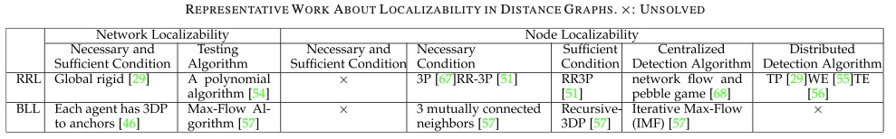

When unlocalizable nodes participate in the BLL localization, the algorithm even doesn't converge. 

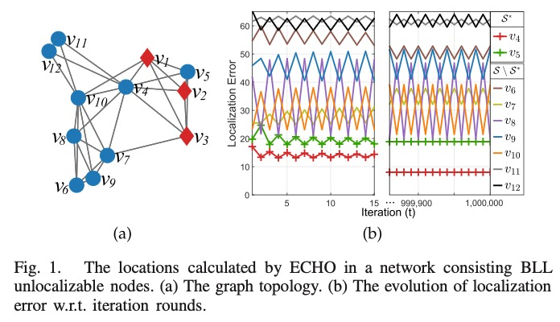

<h2 align = "center">
Contributions
</h2>

- The issues of BLL localization are firstly investigated: (1) we show when some unlocalizable nodes participate in the BLL iteration, even the localizable nodes may converge to wrong locations. (2) The importance of implicit edge to BLL localizability detection is illustrated. (3) The RRL node localizability detection algorithms are shown to fail to detect some BLL localizable nodes and they require special anchor distribution to launch.

  • A distributed *negative edge inference* (NEI) algorithm is proposed to infer the implicit edges (the unmeasured edges with unique length) in each node’s neighborhood. NEI is highly efficient and uses only one-hop neighbor- hood distance information.

  • Based on the information proved by NEI, a new suffi- cient condition, i.e., *Recursive-3DP on the strengthened distance graph* is proposed for BLL node localizability detection. It detects much more BLL localizable nodes than the condition without using NEI.

  • A distributed *path extension and pruning* (PEP) algorithm is designed for detecting BLL localizable nodes distrib- utively. It does not need special anchor distribution and theoretically guarantees to detect all the Recursive-3DP nodes in the strengthened graph.

  • A *Fast-PEP* algorithm is also proposed to detect disjoint paths using the shortest paths. It greatly improves effi- ciency while preserving the detection capability. Experi- ments show that Fast-PEP miss very limited number of Recursive-3DP nodes than PEP.

  • Then a *Localizability Aware Barycentric linEar Local- ization framework (LABEL)* is proposed, in which each node runs NEI and PEP (Fast-PEP) to select localizable neighbors to form the distributed linear equation. LABEL can guarantee the correct location convergence. Benefited by PEP and NEI, it discovers and correctly localizes much more localizable nodes than existing methods and thus improves the application scope of BLL algorithms.

<h2 align = "center">
Main Algorithms
</h2>

1.   Negative Edge Inference (NEI): **NEI Improves Node Localizability.** NEI better reveals the true connectivity among neighbors, which is exactly what BLL node localizability requires as we have mentioned. Thus, the BLL node localizability can be significantly improved. 

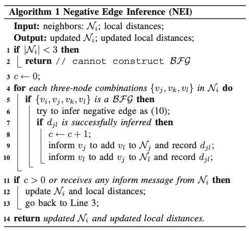

2.   PEP is designed leveraging the distributed consensus idea. (1) In the extension stage, each node learns whether it has 3DP to anchors in GA through distributed consensus. A node is called a *3DP node* if it has 3DP to anchors. Otherwise, it is called a *non-3DP node*; (2) In the pruning stage, since the 3DP to anchors must reside in GA, each node prunes the paths passing through *non-3DP nodes* and rechecks its 3DP property. After path pruning, if a 3DP node no longer has 3DP to anchors, it is excluded from 3DP nodes. The removal of a 3DP node will affect the paths passing through it. The process repeats until each remaining 3DP node finds 3DP to anchors by only passing 3DP nodes, i.e., the remaining 3DP nodes satisfy Recursive-3DP and are BLL localizable.

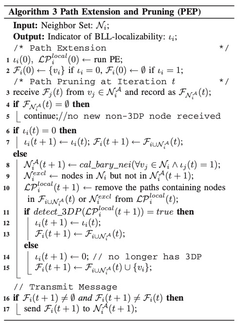

3.   After distributed BLL localizable node detection, each node can select only localizable neighbors to construct its linear equation, so that the impacts of the unlocalizable nodes can be excluded. Then the incorrect convergence problem is avoided. A *Localizability Aware Barycentric linEar Localization framework (LABEL)* is therefore formed, which is detailed in Algorithm 5.

     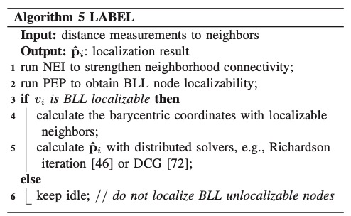


<h2 align = "center">
Evaluations
</h2>

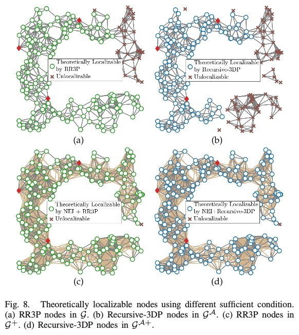

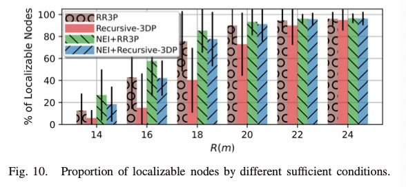

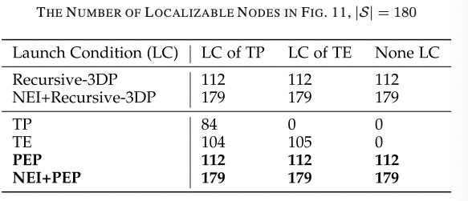

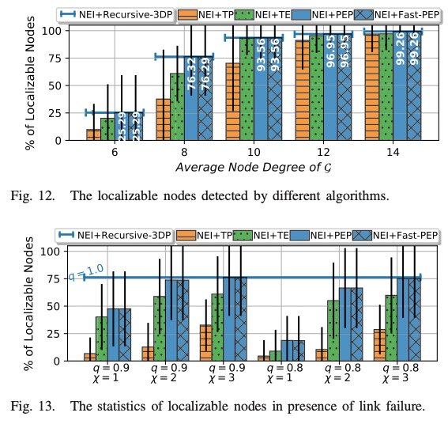

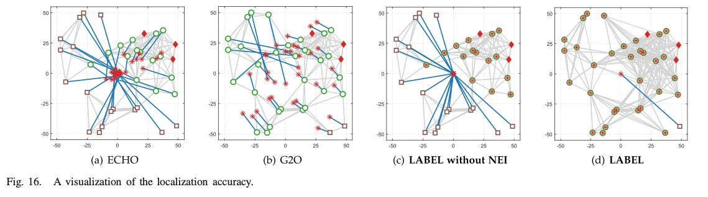

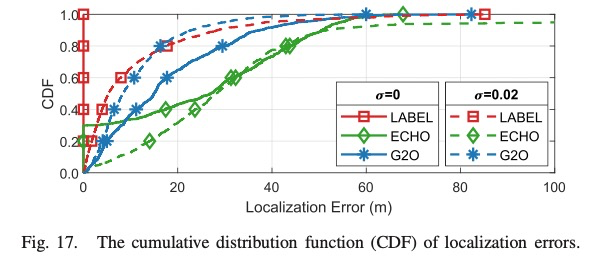

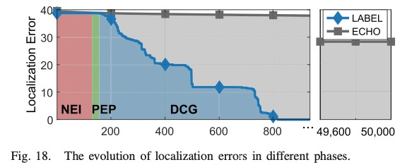

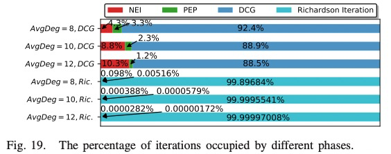

<h2 align = "center">
BibTex
</h2>
```tex
@ARTICLE{ping2022,
  author={Ping, Haodi and Wang, Yongcai and Li, Deying and Chen, Wenping},
  journal={IEEE/ACM Transactions on Networking}, 
  title={Understanding Node Localizability in Barycentric Linear Localization}, 
  year={2023},
  volume={31},
  number={3},
  pages={1353-1368},
  keywords={Location awareness;Distance measurement;Detection algorithms;Image edge detection;Convergence;Rigidity;Linear systems;Barycentric coordinate;distributed localization;node localizability condition;distributed localizability detection},
  doi={10.1109/TNET.2022.3216204}}

```

<h2 align = "center">
Acknowledgment 
</h2>
This work was supported in part by the National Natural Science Foundation of China under Grant 61972404, Grant 12071478, and Grant 61732006; and in part by the Public Computing Cloud, Renmin University of China.
