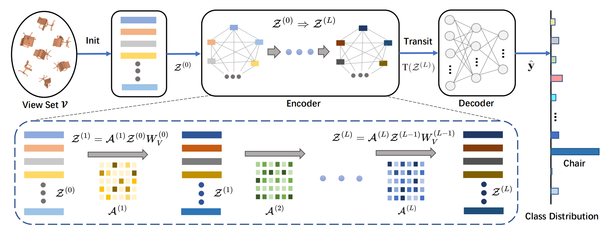

<h2 align = "center">
VSFormer: Mining Correlations in Flexible View Set for Multi-view 3D Shape Understanding
</h2>
<h4 align = "center" >
 <a href="https://ieeexplore.ieee.org/document/10478769">2024 IEEE Transactions on Visualization and Computer Graphics (TVCG)</a>
</h4>

Hongyu Sun, Yongcai Wang*, Peng Wang, Haoran Deng, Xudong Cai, Deying Li

School of Information, Renmin University of China, Beijing, 100872 

<center>
  <a href="VSFormer.pdf"> 
  </a>
  <a href="https://github.com/auniquesun/VSFormer">
  
  </a>  
</center>


<h2 align = "center">
Overview 
</h2>
View-based methods have demonstrated promising performances in 3D shape understanding. However, they tend to make strong assumptions about the relations between views or learn the multi-view correlations indirectly, which limits the flexibility of exploring inter-view correlations and the effectiveness of target tasks. To overcome the above problems, this paper investigates flexible organization and explicit correlation learning for multiple views. In particular, we propose to incorporate different views of a 3D shape into a permutation-invariant set, referred to as View Set, which removes rigid relation assumptions and facilitates adequate information exchange and fusion among views. Based on that, we devise a nimble Transformer model, named VSFormer, to explicitly capture pairwise and higher-order correlations of all elements in the set. Meanwhile, we theoretically reveal a natural correspondence between the Cartesian product of a view set and the correlation matrix in the attention mechanism, which supports our model design. Comprehensive experiments suggest that VSFormer has better flexibility, efficient inference efficiency and superior performance. Notably, VSFormer reaches state-of-the-art results on various 3d recognition datasets, including ModelNet40, ScanObjectNN and RGBD. It also establishes new records on the SHREC’17 retrieval benchmark. The code and datasets are available at https://github.com/auniquesun/VSFormer

<h2 align = "center">
System Architecture 
</h2>
Several critical designs are presented in VSFormer. (1) The position encodings of input views are removed since views are permutation invariant. (2) The class token is removed because it is irrelevant to capturing the correlations of view pairs in the set. (3) The number of attention blocks is greatly reduced as the size of a view set is relatively small (≤ 20 in most cases).



<h2 align = "center">
Contributions
</h2>

- We identify two key aspects of multi-view 3D shape understanding, organizing views reasonably and modeling their relations explicitly, albeit they are critical for performance improvement but absent in previous literature.

- We propose a Transformer-based model, named VSFormer, to capture the correlations of all view pairs directly for better multi-view information exchange and fusion. At the same time, a theoretical analysis is accompanied to support such a design.

- Extensive experiments demonstrate the superb performances of the proposed approach and the ablation studies shed light on the various sources of performance gains. For the recognition task, VSFormer reaches 98.4%(+4.1%), 95.9%(+1.9%), 98.8%(+1.1%) overall accuracy on RGBD, ScanObjectNN, ModelNet40, respectively.  The results surpass all existing methods and achieve new state of the arts. For 3D shape retrieval, VSFormer also sets new records in multiple dimensions on the SHREC’17 benchmark.

<h2 align = "center">
Evaluations
</h2>


<h2 align = "center">
Ablation Studies
</h2>

- **Initializer.** 


- **The Architecture of Encoder.**


- **Performance Gains Delivered by Our Encoder.**


- **Number of Attention Blocks.** 


- **Number of Views.** 


<h2 align = "center">
Bad Case Analysis
</h2>

- Here we carry out a bad case analysis of the proposed model. The study covers recognition and retrieval tasks on different datasets, including ModelNet40 and SHREC’17. The input views come from the corresponding test set and the incorrect predictions of our model are visualized in Figure 8. For the recognition task, the model is confused by shapes with highly similar appearances, resulting in incorrect outputs on occasion. As the subfigure 8a displays, our model predicts the bathtub views as the bowl category, the bookshelf views as table category, and the bottle views as flower pot category. The bottle and flower pot have close appearances and share the function of holding water. Note that the views in the right part (Prediction) are found in the training set and they are hard to distinguish from corresponding input views, even for human beings.

- For 3D shape retrieval, its performance is affected by classification accuracy since the misclassified result of a query  shape will propagate in the retrieval process, where the model tries to find shapes that have the same category as the query. Here we visualize the misclassification of several query shapes on the SHREC’17 benchmark, exhibited in the subfigure 8b. For instance, the query in the first row is a faucet but our model recognizes it as a lamp. The misclassification is somewhat understandable as there are views of lamp in the training set with extremely close appearances with faucet, seeing the corresponding prediction part. Interestingly, in the third row, our model regards two chairs side by side as sofa, probably because it learns the common sense that sofa is more likely to have consecutive seats than chair.


<h2 align = "center">
BibTex
</h2>
```tex
@ARTICLE{sun24vsformer,
  author={Sun, Hongyu and Wang, Yongcai and Wang, Peng and Deng, Haoran and Cai, Xudong and Li, Deying},
  journal={IEEE Transactions on Visualization and Computer Graphics}, 
  title={VSFormer: Mining Correlations in Flexible View Set for Multi-view 3D Shape Understanding}, 
  year={2024},
  volume={},
  number={},
  pages={1-15},
  keywords={Three-dimensional displays;Shape;Correlation;Feature extraction;Solid modeling;Transformers;Aggregates;Multi-view 3D Shape Recognition and Retrieval;Multi-view 3D Shape Analysis;View Set;Attention Mechanism},
  doi={10.1109/TVCG.2024.3381152}
}
```


<h2 align = "center">
Acknowledgment 
</h2>
This work was supported in part by the National Natural Science Foundation of China under Grants No. 61972404 and No. 12071478, and Public Computing Cloud, Renmin University of China, and the Blockchain Lab, School of Information, Renmin University of China.
